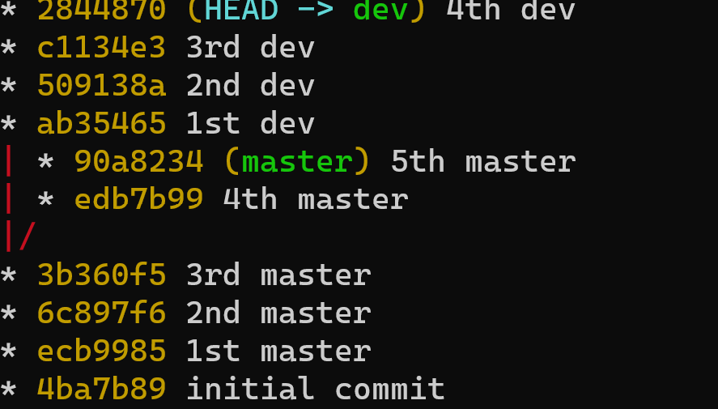
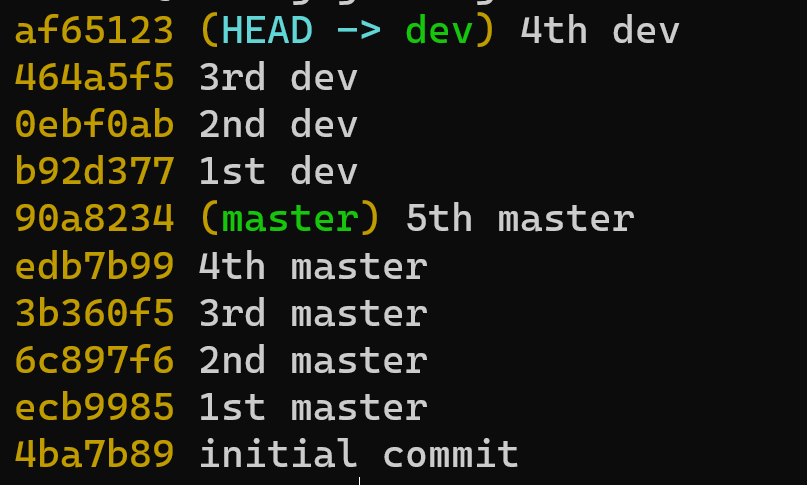

# GIT

## Basics
Git is used to keep track of all your work that you choose to save. It does so by saving a sequence of "snapshots" or versions of your files. 

A version of a file can be in one of three places as show in the figure : working directory, staging area, or git directory


The working directory is just that: the files and folders that reside on your filesystem. You can view the structure and content of the working directory using file explorer.
The staging area is a file kep by Git, stores information about what will go into your next snapshot (commit).
The git directory contains a complete history of all your saved(committed) snapshots and relation between them.

The figure also shows the typical commands that are used to move a version of a file between the three stages.
It should be noted that in the working directory and staging area there could be only one version of a given file. The Git directory, however, can contain multiple versions of the file.

The working directory contains the files that you are working on. The staging area contains contains information on what **will be** in the next commit.
A typical workflow would be:
1. Modify files in the working directory
2. "add" the modified files to the staging area
3. "commit" the files in the staging area to the local git repository (directory)
   
### Initialization

Typically there are two ways to start version control on a directory. The first is initializing the directory to be under version control.

We start with an example. Create a folder called git (on Windows). Open a terminal and cd to that folder.

```bash
>git init
>git status
On branch master
No commits yet
nothing to commit (create/copy files and use "git add" to track)
```
Now create a new file, ```file1.txt```
```bash
>echo "first version of file1" > file1.txt
>git log
fatal: your current branch 'master' does not have any commits yet
>git status
On branch master
No commits yet
Untracked files:
  (use "git add <file>..." to include in what will be committed)
        file1.txt

nothing added to commit but untracked files present (use "git add" to track)
```
At this point file1.txt is newly added to the working directory, so it is untracked. To start tracking it, we add it to the index using the **add** command.

```bash
>git add file1.txt
>git status
On branch master
No commits yet
Changes to be committed:
  (use "git rm --cached <file>..." to unstage)
        new file:   file1.txt
```
So now there are two (identical) copies of file1, in the **working** directory and in the **index**. If we make changes to file1.txt they will affect the one in the **working** directory only. Edit "file1.txt", by adding the line "second version of file1.txt".

```bash
>echo "second version of file1.txt">>file1.txt
>git status
On branch master
No commits yet
Changes to be committed:
  (use "git rm --cached <file>..." to unstage)
        new file:   file1.txt

Changes not staged for commit:
  (use "git add <file>..." to update what will be committed)
  (use "git restore <file>..." to discard changes in working directory)
        modified:   file1.txt
```

At this point the version in the **working** directory and the **index** are different. We can either add the second
version to the **index**, commit the **index**, or restore the version in the index (that contains one line only) to the working directory.
Let us try the last option.
```bash
>cat file1.txt

first version of file1.txt
second version of file1.txt

>git restore file1.txt
>git status
On branch master
No commits yet
Changes to be committed:
  (use "git rm --cached <file>..." to unstage)
        new file:   file1.txt
>cat file1.txt

first version of file1
```

Our next action is to commit the content of the **index** (staging area).
```bash
>git commit -m "added first version of file1"
>git status
On branch master
nothing to commit, working tree clean
```
Next we add the line "second version of text1" to file1.txt, add it to the index then add "third version" to file1. 
```bash
>echo "second version of file1.txt">> file1.txt
>git add file1.txt
>echo "third version of file1.txt">> file1.txt
```
At this point we have **three** versions of file1.txt: 
- one in the working directory
- one in the index
- one was committed. 

We can compare the difference between the three versions using the **diff** command.
First we show the difference between working tree and index.

```bash
>git diff
diff --git a/file1.txt b/file1.txt
index 0005eef..73c2f46 100644
--- a/file1.txt
+++ b/file1.txt
@@ -1,2 +1,3 @@
 first version of file1.txt
 second version of file1.txt
+third version of file1.txt
```

The above says that the version in the working tree has an extra line "third version of file1.txt" which doesn't exist in the index.
In general, a line preceded with '-' means it is in ```a``` but not in ```b``` and '+' it is in ```b``` not in ```a```.
We can also show the difference between working tree and the last commit.

```bash
>git diff HEAD #or git diff master or main 
               # depending on the name of the branch

diff --git a/file1.txt b/file1.txt
index 7436323..73c2f46 100644
--- a/file1.txt
+++ b/file1.txt
@@ -1 +1,3 @@
 first version of file1.txt
+second version of file1.txt
+third version of file1.txt
```
Finally, we can show the difference between the index and the last commit (or any specified commit)
```bash
>git diff --cached 
diff --git a/file1.txt b/file1.txt
index 7436323..0005eef 100644
--- a/file1.txt
+++ b/file1.txt
@@ -1 +1,2 @@
 first version of file1.txt
+second version of file1.txt
```
```git diff --cached``` 
shows the difference between the **index** and last commit.

```git diff``` shows the difference between **working** directory and **index**

```git diff commit``` shows the difference between working directory and a commit

### Branching


Typically, to work on a new feature in a software base we create a new branch from the main one. This way all the changes we make do not affect the supposedly "working code". But after we are done developing the new feature we would like to incorporate  the new changes back into the main part. Before we proceed we perform two commits to get three different 
versions of file1.txt in the database.
```bash
>git commit -m "added second version of file1"
# at this point the version in the index in the commit are the same. You can check using diff
>git add file1.txt
>git commit -m "added third version of file1"
>git log --oneline
31c7080 (HEAD -> master) added third version of file1
6b2bfba added second version of file1
da21bb7 added first version of file1
6b66b6a initial commit
```
Simple branching example. 
```bash
>git checkout -b dev # or git branch dev ; git checkout dev
>git log --oneline
31c7080 (HEAD -> dev, master) added third version of file1
6b2bfba added second version of file1
da21bb7 added first version of file1
6b66b6a initial commit
```

Notice that in the above output HEAD is pointing to dev.
On branch dev we add a new file: file2.txt then make a second version of file2.txt
```bash
>echo "first version of file2"> file2.txt
>git add file2.txt
>git commit -m "first version of file2"
>echo "second version of file2">> file2.txt
>git commit -a -m "second version of file2"
```
Now switch back to branch master and add file3.txt and then a second version of file3.txt

```bash
>git checkout master
>echo "first version of file3"> file3.txt
>git add file3.txt
>git commit -m "first version of file3"
>echo "second version of file3">> file3.txt
>git commit -a -m "second version of file3"
>git log --oneline -graph --all
```


As you can see from the figure above we now have two divergent, but separate, branches.
## Remote branches
First create a local branch then push it to the remote. Example

```
git branch experimental
git checkout experimental
git push origin experimental
```
### Merging 
 Once we are satisfied with the "development" on branch dev typically we want to incorporate the changes into master. We make sure first that we are "on" branch master.

```bash
>git checkout master
Already on 'master'
>git merge dev
```
A default editor will open with a default message "Merge branch 'dev'". We can change the message then save and quit.
```bash
>git log --oneline --graph --all
```

At this point branch master contains all the changes made in dev (note that file2.txt was created and modified on branch dev only)
```bash
>ls
file1.txt  file2.txt  file3.txt
```
Suppose that we made a mistake in merging and we want to undo it. Consulting the output of the log we see that the last commit before merge was 4ef2bf5.
```bash
>git reset --hard 4ef2bf5
>git log --oneline --graph --all
```

Lets do the merge again but this time passing the message on the command line
```bash
>git merge dev -m "Merging dev into master"
```
The merging operation went smoothly because we made sure not to change a file common between branches.
If there are different versions of the same file git does not know which one to choose so it is up to us to decide.
```bash
>git checkout dev
>echo "changed on dev">>file2.txt
>git commit -a -m "changed file2 on dev"
>git checkout master
>echo "changed on master">> file2.txt
>git commit -a -m "changed file2 on master"
>git merge dev
Auto-merging file2.txt
CONFLICT (content): Merge conflict in file2.txt
Automatic merge failed; fix conflicts and then commit the result.
```
git is telling us that it cannot perform the merge because there is a conflict between the two versions. 
```bash
>git status
On branch master
You have unmerged paths.
  (fix conflicts and run "git commit")
  (use "git merge --abort" to abort the merge)

Unmerged paths:
  (use "git add <file>..." to mark resolution)
        both modified:   file2.txt

no changes added to commit (use "git add" and/or "git commit -a")
```

But it also tells us where the conflict is
```bash
>cat file2.txt
first version of file2
second version of file2
changed on master
changed on dev
```
We can choose the version (or both) we want by editing the file, the committing. So after editing the file to our liking
```bash
>git commit -a -m "fixed merge conflict on file2.txt"
>git log --oneline --graph --all
```


### Rebase
Rebase allows us to change the **base** of a sequence of commits. Below we create two branches, master and dev, each with a series of commits.

Starting from an empty working directory we do  some commits on the master branch.
```bash
>echo "first line">file1.txt
>git init
>git add file1.txt
>git commit -m "1st master"
>echo "second line">>file1.txt
>git commit -a -m "2nd master"
>echo "third line">>file1.txt
>git commit -a -m "3rd master"
>git log --oneline

```
The commit history will look something like this.

Then we create a **dev** branch and add some commits to it.

```bash
>git checkout -b dev
>echo "file2">>file2.txt
>git add file2.txt
>git commit -m "1st dev"
```
Then switch back to master and add some commits.
```bash
>git checkout master
>echo "4th line">>file1.txt
>git commit -a -m "4th master"
>echo "5th line">>file1.txt
>git commit -a -m "5th master"
```
The history will look something like this.


The common  ancestor of both branches is the commit 3a99d41 which as far as git is concerned is the **base** of branch dev.
```bash
>git checkout dev
>git rebase master
>git log --oneline --graph --all
```

Basically, we are telling git to use master as a base for which to add all the commits of the dev branch since it branched out from master.
Another way to look at it is to use master as a base for commits from 3a99d41 to dev where 3a99d41 is automatically detected by git as the common ancestor of the two branches.


### Example

Below we create two branches with a series of commits. Each commit on master includes a new file. For example, in commit "1st master" file "master1.txt" was added... and for dev commit "1st dev" file "dev1.txt" was added.
```bash
>git log --oneline --graph --all
```


As can be seen the sequence of commits "4th dev",...,"1st dev" has commit "3rd master" as ancestor.  We rebase it on master,i.e. "5master" becomes the new ancestor.
```bash
#git rebase --onto new-base old-base tip
>git --onto master 3b360f5 dev
>git log --oneline --graph --all
```


### Cleaning up history

Sometimes the log becomes very long and we would like to get rid of the earlier commits. We can do that using rebase as follows. First we create an "orphan" branch were we want the new history to start.
First we remove the dev branch.
```bash
>git branch -D dev
```
Then 
```bash
>git checkout --orphan temp 3b360f5
>git commit -m "new initial commit"
```
Next we rebase the sequence of commits 3b360f5 to master from the new orphan branch
```bash
>git rebase --onto temp 3b360f5 master
>git log --oneline --graph --all
```


### FIX ME
```
git diff --name-only sha1 sha2
```

```
git diff --name-status sha1 sha2

```

```
git show ???
```


### Remote repos and Github
To add a remote repo you need the url and give it a name
```
git remote add origin URL
```
Here we gave it the name origin (instead of using URL every time)
To fetch the info about the remote 
```bash
git fetch origin
```

to associate an existing local branch with  remote
```bash
git branch --set-uptream-to=origin/branch-name local-branch-name
```

If we have a local branch, say ```someBranch```, that doesn't exist in the remote, and we want to add it
with a different name, say ```anotherName```

```bash
git push --set-upstream origin anotherName

```

## Real (sort of) programming example

In this example we will simulate how you would go about developing the solution for one of your labs (Leaderboard).
We initialise the repository by adding ```init_leaderboard``` and ```add_player``` functions.
Create ```leaderboard.py``` and copy the code below into it.

```python
from datetime import datetime,timedelta

def init_leaderboard()->dict[str,timedelta]:
    return {}


def add_player(leaderboard:dict[str,timedelta],player_name:str)->bool:
    if player_name in leaderboard:
        return False
    leaderboard.update({player_name:None})
    return True
```
and save. PyCharm and Python create a ```.idea```  and a ```__pychache``` folders respectively. We don't want to add those folders to git so create a ```.gitignore``` file containing
```bash
.idea
__pycache__
```

Now commit the first version to the repo.

```bash
git init
git add leaderboard .gitignore
git commit -m "implemented init and add_player"
```
Next, "two of our developers" will implement ```add_run``` and ```clear_score```. Towards that end, each developer creates a different branch
```bash
git branch -c feature1
git branch -c feature2
```
Note: Each developer works on their local computer and since the feature branches will be deleted later it is possible for both branches to have the same name "feature" since they are on different computer and will not be uploaded to the remote server.
For now, since we are "simulating" this workflow on the same computer we give the two branches different names.
The "first developer" works on ```add_run```
```bash
git checkout feature1
```
copy the code below to ```leaderboard.py```

```python
def add_run(leaderboard:dict[str,timedelta],player_name:str,time:timedelta)->int:
    if time.total_seconds()<0:
        return 1
    if player_name not in leaderboard:
        return 2
    
    if leaderboard[player_name]==None or leaderboard[player_name]> time:
        leaderboard.update({player_name:time})
    return 0
```
Save the file and
```bash
git commit -a -m "implemented add_run"
```
The "second developer" uses the dev2 branch.
```bash
git checkout feature2
```
copy the code below to ```leaderboard.py```
```python
def clear_score(leaderboard,player_name):
    if player_name not in leaderboard:
        return False
    leaderboard.update({player_name:None})
    return True
```
Save the file and 
```bash
git commit -a -m "implemented clear_score"
```
at this point we check the progress and we see that the two development branches have diverged
```bash
git log --oneline --graph --all
```


To incorporate the changes we merge the two branches into dev.
```bash
git checkout dev
git merge feature1
```
Next we incorporate the changes from dev2. This will cause a merge conflict.
```bash
git merge feature2
```
You can fix the merge conflict either by editing the code in ```leaderboard.py``` directly. When you open ```leaderboard.py``` in any editor you will see something like this:
```
...
...
<<<<<<<<HEAD
content in main but not in dev2
=======
content in dev2 but not in main
>>>>>>>> feature2

```
You can edit the above the way you like but in this case we want to keep both changes so all we have to do is remove the lines containing "<<<<<<", ">>>>>>" and "=======" and save the file.
```bash
git add leaderboard
git commit -m "merged feature1 and feature2"
```
A second way to do the merge is by using your IDE. For example, after the second merge command, open ```leaderboard.py``` in PyCharm and click the button at the top right corner "resolve conflicts" which will open a window with 3 panes as shown below.

You can choose to add or remove the parts which are different. In our case we need to add both so press on ">>" on both left and right panes and press "apply". Finally
```bash
git commit -m "merged feature1 and feature2"
```

Now developer 1 is tasked with implementing ```display_leaderboar```. First we need to bring branch ```dev1``` in line with ```main```.

```bash
git checkout dev1
git merge main
```
Copy the code below to ```leaderboard.py```.
```python

def display_leaderboard(leaderboard,n=3):
    
    lst=sorted(leaderboard.items(),key=lambda x:x[1])
    r=min(n,len(lst))
    count=0
    
    for i in range(r):
        if lst[i][1] is not None:
            print(f'{i+1}\t{lst[i][0]}\t{lst[i][1]}')
            count+=1
    if count==0:
        print("Leaderboard is empty")
```
```bash
git commit -a -m "implemented display"
git log --oneline --graph --all
```


Usually it is best to run some tests before committing, which we forgot to do. Add the following code
```python
lb=init_leaderboard()
add_player(lb,player_name='Jon')
add_player(lb,player_name='Chris')
add_run(lb,player_name='Jon',time=timedelta(minutes=47))
add_run(lb,player_name='Chris',time=timedelta(minutes=18))
add_run(lb,player_name='Jon',time=timedelta(minutes=23))
display_leaderboard(lb)

```
We don't want to add an extra commit but replace the last one, so
```bash
git add leaderboard.py
git commit --amend -m "implemented display with tests"
```

Notice how the new commit replaced the last one. The hash is different because the message is different.

We have a (almost) working code.
This development phase is done so we delete the dev branches
```bash
git branch -D dev1
git branch -D dev2
```


A problem occurs if a player has no run (None). For example, if we add a player "Jack" without any run we get an error when ```display_leaderboard``` is called. This is caused by the ```sorted``` function since ```None``` is not comparable.
```python
lb=init_leaderboard()
add_player(lb,player_name='Jon')
add_player(lb,player_name='Chris')
add_player(lb,player_name='Jack')
add_run(lb,player_name='Jon',time=timedelta(minutes=47))
add_run(lb,player_name='Chris',time=timedelta(minutes=18))
add_run(lb,player_name='Jon',time=timedelta(minutes=23))
display_leaderboard(lb)
```
A quick fix is to replace
```python
lst = sorted(leaderboard.items(), key=lambda x: x[1])
```
by
```python
    lst = sorted(leaderboard.items(), key=lambda x: (x[1] is None, x[1]))
```
For bug fixes we usually create a new branch. ```git switch -c fix``` then replace the code as above and
```bash
git commit -a -m "fixed sorted"
git checkout main
git merge fix
git branch -D fix
git log --oneline --graph --all
```

We can compare the fix with the previous commit
```bash
git diff  69c0705 c75dd7e
```


Finally, we push the changes to the remote
```bash
git push -u origin main
```
