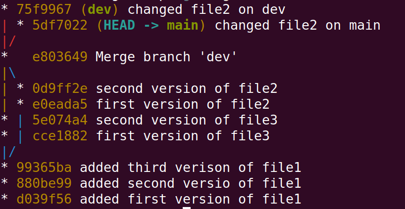
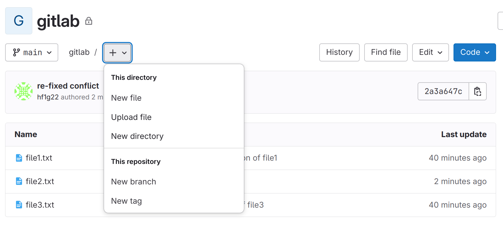

# GIT

To start with create two sibling directories (folders) named "git" and "git-tmp". You will do all the work in "git-tmp". 
```bash
$mkdir git-tmp
$git clone https://github.com/hikmatfarhat-ndu/git/

```
The above two commands create two sibling directories, "git-tmp" which is initially empty, and "git" that contains many files, the most important being "create_git.sh".

This file is a script that allows you to reproduce the steps in case you made a mistake. For example, if you want to execute all the steps up to and including section 3.
```bash
$cd git
$./create_git.sh 3
```

## 1. Basics
Git is used to keep track of all your work that you choose to save. It does so by saving a sequence of "snapshots" or versions of your files. 

A version of a file can be in one of three places as show in the figure : working directory, staging area, or git directory


The working directory is just that: the files and folders that reside on your filesystem. You can view the structure and content of the working directory using file explorer.
The staging area is a file kep by Git, stores information about what will go into your next snapshot (commit).
The git directory contains a complete history of all your saved(committed) snapshots and relation between them.

The figure also shows the typical commands that are used to move a version of a file between the three stages.
It should be noted that in the working directory and staging area there could be only one version of a given file. The Git directory, however, can contain multiple versions of the file.

The working directory contains the files that you are working on. The staging area contains contains information on what **will be** in the next commit.
A typical workflow would be:
1. Modify files in the working directory
2. "add" the modified files to the staging area
3. "commit" the files in the staging area to the local git repository (directory)
   
<!-- ### 1.1 Initialization -->

Typically there are two ways to start version control on a directory. The first is initializing the directory to be under version control.

We start with an example. Open a terminal and ```cd```  (change directory) to folder "git-tmp". 
```bash
$git init
$git status
On branch main
No commits yet
nothing to commit (create/copy files and use "git add" to track)
```
**Note**: depending on the version of git the initial branch could be called "master" instead of "main". If this is the case change its name to "main" using ```git branch -m main```. 
Now create a new file, ```file1.txt```
```bash
$echo "first version of file1" > file1.txt
$git log
fatal: your current branch 'main' does not have any commits yet
$git status
On branch main
No commits yet
Untracked files:
  (use "git add <file>..." to include in what will be committed)
        file1.txt

nothing added to commit but untracked files present (use "git add" to track)
```
At this point file1.txt is newly added to the working directory, so it is untracked. To start tracking it, we add it to the index using the **add** command.

```bash
$git add file1.txt
$git status
On branch main
No commits yet
Changes to be committed:
  (use "git rm --cached <file>..." to unstage)
        new file:   file1.txt
```
So now there are two (identical) copies of file1.txt, in the **working** directory and in the **index**. If we make changes to file1.txt they will affect the one in the **working** directory only. Edit "file1.txt", by adding the line "second version of file1".
(**note** the difference between ```>```, overwrite, and ```>>```, append )

```bash
$echo "second version of file1">>file1.txt
$git status
On branch main
No commits yet
Changes to be committed:
  (use "git rm --cached <file>..." to unstage)
        new file:   file1.txt

Changes not staged for commit:
  (use "git add <file>..." to update what will be committed)
  (use "git restore <file>..." to discard changes in working directory)
        modified:   file1.txt
```

At this point the version in the **working** directory and the **index** are different. We can either add the second version to the **index**, then **commit**, or restore the version in the index (that contains one line only) to the working directory.
Let us try the last option.
```bash
$cat file1.txt

first version of file1
second version of file1

$git restore file1.txt
$git status
On branch mains
No commits yet
Changes to be committed:
  (use "git rm --cached <file>..." to unstage)
        new file:   file1.txt
$cat file1.txt

first version of file1
```

Our next action is to commit the content of the **index** (staging area).
```bash
$git commit -m "added first version of file1"
$git status
On branch main
nothing to commit, working tree clean
```
Next we add the line "second version of text1" to file1.txt, add it to the index then add "third version" to file1. 
```bash
$echo "second version of file1">> file1.txt
$git add file1.txt
$echo "third version of file1">> file1.txt
```
At this point we have **three** versions of file1.txt: 
- one in the working directory (3 lines)
- one in the index (2 lines)
- one was committed (1 line) 

We can compare the difference between the three versions using the **diff** command.
First we show the difference between working tree and index.

```bash
$git diff
diff --git a/file1.txt b/file1.txt
index 0005eef..73c2f46 100644
--- a/file1.txt
+++ b/file1.txt
@@ -1,2 +1,3 @@
 first version of file1.txt
 second version of file1.txt
+third version of file1.txt
```

The above says that the version in the working tree (b) has an extra line "third version of file1.txt" which doesn't exist in the index (a).
In general, a line preceded with '-' means it is in ```a``` but not in ```b``` and '+' it is in ```b``` not in ```a```.
We can also show the difference between working tree (b) and the last commit (a).

```bash
$git diff HEAD #or git diff master or main 
               # depending on the name of the branch

diff --git a/file1.txt b/file1.txt
index 7436323..73c2f46 100644
--- a/file1.txt
+++ b/file1.txt
@@ -1 +1,3 @@
 first version of file1.txt
+second version of file1.txt
+third version of file1.txt
```
Finally, we can show the difference between the index (b) and the last commit (a) (or any specified commit)
```bash
$git diff --cached 
diff --git a/file1.txt b/file1.txt
index 7436323..0005eef 100644
--- a/file1.txt
+++ b/file1.txt
@@ -1 +1,2 @@
 first version of file1.txt
+second version of file1.txt
```
```git diff --cached``` 
shows the difference between the **index** (b) and last commit (a).

```git diff``` shows the difference between **working directory** (b) and **index** (a)

```git diff commit``` shows the difference between working directory (b) and a commit (a)
```bash
$git commit -m "added second version of file1"
# at this point the version in the index and the commit are the same. You can check using diff
$git add file1.txt
$git commit -m "added third version of file1"
$git log --oneline
* 99365ba (HEAD -> main) added third verison of file1
* 880be99 added second versio of file1
* d039f56 added first version of file1
```


**Note**: you will get different values for the hashes because the hash includes the author of the commit and the timestamp (try ```git log``` to see the full information)

## 2. Branching


Typically, to work on a new feature in a software base we create a new branch from the main one. This way all the changes we make do not affect the supposedly "working code". But after we are done developing the new feature, we would like to incorporate  the new changes back into the main part. 

<!-- Before we proceed we perform two commits to get three different versions of file1.txt in the database. -->

A simple branching example. 

```bash
$git checkout -b dev # or git branch dev ; git checkout dev
$git log --oneline --graph --all
* 99365ba (HEAD -> dev, main) added third verison of file1
* 880be99 added second versio of file1
* d039f56 added first version of file1

```
Notice that in the above output HEAD is pointing to dev.
On branch dev we add a new file: file2.txt then make a second version of file2.txt.

```bash
$echo "first version of file2"> file2.txt
$git add file2.txt
$git commit -m "first version of file2"
$echo "second version of file2">> file2.txt
$git commit -a -m "second version of file2"
```
Now switch back to branch main and add file3.txt and then a second version of file3.txt

```bash
$git checkout main
$echo "first version of file3"> file3.txt
$git add file3.txt
$git commit -m "first version of file3"
$echo "second version of file3">> file3.txt
$git commit -a -m "second version of file3"
$git log --oneline -graph --all
```


As you can see from the figure above we now have two **divergent**, but separate, branches.

## 3. Merging 
 Once we are satisfied with the "development" on branch **dev** typically we want to incorporate the changes into master. We make sure first that we are "on" branch main.

```bash
$git checkout main
Already on 'main'
$git merge dev
```
A default editor will open with a default message "Merge branch 'dev'". We can change the message then save and quit.
```bash
$git log --oneline --graph --all
```

At this point branch main contains all the changes made in dev (note that file2.txt was created and modified on branch dev only)
```bash
$ls
file1.txt  file2.txt  file3.txt
```
The merging operation went smoothly because we made sure not to change a file common between branches.
If there are different versions of the same file, git does not know which one to choose so it is up to us to decide. Next we will try to merge two branches where ```file2.txt``` changed in both. But first, we get **dev** up to date with **main**.

```bash

$git checkout dev
$git merge main # get dev up to date with main
$echo "added lines on dev" >> file2.txt
$echo "changed on dev">>file2.txt
$git commit -a -m "changed file2 on dev"
$git checkout main
$echo "changed on main">> file2.txt
$git commit -a -m "changed file2 on main"
$git merge dev
Auto-merging file2.txt
CONFLICT (content): Merge conflict in file2.txt
Automatic merge failed; fix conflicts and then commit the result.
```
git is telling us that it cannot perform the merge because there is a conflict between the two versions. 
```bash
$git status
On branch master
You have unmerged paths.
  (fix conflicts and run "git commit")
  (use "git merge --abort" to abort the merge)

Unmerged paths:
  (use "git add <file>..." to mark resolution)
        both modified:   file2.txt

no changes added to commit (use "git add" and/or "git commit -a")
```

But it also tells us where the conflict is
```bash
$cat file2.txt
first version of file2
second version of file2
<<<<<<< HEAD
changed on main
=======
added lines on dev
changed on dev
>>>>>>> dev

```
The part between ```<<<<<<<HEAD``` and ```=======``` is in **main** but not in **dev** and between  ```=======``` and ```>>>>>>>dev``` is in **dev** but not in **main**.

We can choose the version  we want (or both) by editing the file, then commit. So after editing the file to our liking, say removing the line "added lines on dev" and the separator lines (with '<<<<<HEAD','=========','>>>>>>>>>>>>dev'):
```bash
$cat file2
first version of file2
second version of file2
changed on main
changed on dev

$git commit -a -m "fixed merge conflict on file2"
$git log --oneline --graph --all
```


<!-- After merging, we need to keep 'dev' update to date with 'main'.
```bash
git checkout dev
git merge main
```
Note the 'Fast-forward'. This is because,before the last merge, dev pointed to an ancestor of 'main' which means 'main' already incorporated everything in 'dev' so the dev pointer is just advanced to point to main. -->
## 4. Undoing commits
Suppose that we made a mistake in merging and we want to undo it. The safest way to undo commit(s) is to use ```revert```. This command will undo commits by 'creating reverse commits'.

First we can inspect the content of ```file2.txt``` before the merge. Using the above graph we see that the last commit, on **main**, before merge is bbaf50b (or ```main~1```) 
```bash
$git checkout bbaf50b # git checkout main~1 is better
$cat file2.txt
first version of file2
second version of file2
changed on main
$git checkout main # go back to main
$git revert 65bf415 # git revert HEAD is better
error: commit 65bf4151ecc93d15da13d9f01cef52341e9021d2 is a merge but no -m option was given.
fatal: revert failed
```
The error we got is due to the fact that commit 7669ca2 has two parents, so we need to specify which parent to 'revert' to.
```bash
$git revert -m 1 7669ca2 # git revert -m 1 HEAD
$ls
file1.txt  file2.txt  file3.txt
$cat file2.txt
$git log --oneline --graph --all
```


One can check that indeed commits 5493b5b and 5df7022 have the same snapshot by using diff ```git diff 5493b5b 5df7022``` (or ```git diff HEAD main~2```)
(**Caution**: as you can see from the above graph branch dev is now an ancestor of main so ```git checkout dev;git merge main``` will fast-forward dev to main and lose all the work done in the dev branch; i.e. file2.txt)

Another way of undoing commits is to use ```reset```. When we resolved the the previous merge conflict we removed the line "added lines on dev" and kept the line "changed on dev". Suppose that it was a mistake and we should have done the opposite. 

The problem  here is that branch dev points to a commit that is an ancestor of the commit pointed to by main, so ```git checkout dev;git merge main``` will not change the contents of file2. Instead we point main to the commit that we want, in this case to ```main~2```.

(**Note**: be cautious in using reset since it alters the history, especially if you are using a remote server).
```bash
$git reset --hard 5df7022 (or git reset --hard main~2)
$git log --oneline --graph --all
```

Let us do the merge again, but this time  keeping "added lines on dev" and removing "changed on dev".

```bash
$git merge dev 
Auto-merging file2.txt
CONFLICT (content): Merge conflict in file2.txt
Automatic merge failed; fix conflicts and then commit the result.
# after editing as described above
$cat file2.txt
first version of file2
second version of file2
changed on main
added lines on dev

$ git commit -a -m "re-fixed conflict" 
```

<!-- ## 5. Rebase
Rebase allows us to change the **base** of a sequence of commits. We will execute the same sequence as before but use rebase instead of merge. You don't have to redo things manually, run the script ```??``` and it will get you to ???

Starting from an empty working directory we do  some commits on the master branch.
```bash
>echo "first line">file1.txt
>git init
>git add file1.txt
>git commit -m "1st master"
>echo "second line">>file1.txt
>git commit -a -m "2nd master"
>echo "third line">>file1.txt
>git commit -a -m "3rd master"
>git log --oneline

```
The commit history will look something like this.

Then we create a **dev** branch and add some commits to it.

```bash
>git checkout -b dev
>echo "file2">>file2.txt
>git add file2.txt
>git commit -m "1st dev"
```
Then switch back to master and add some commits.
```bash
>git checkout master
>echo "4th line">>file1.txt
>git commit -a -m "4th master"
>echo "5th line">>file1.txt
>git commit -a -m "5th master"
```
The history will look something like this.


The common  ancestor of both branches is the commit 3a99d41 which as far as git is concerned is the **base** of branch dev.
```bash
>git checkout dev
>git rebase master
>git log --oneline --graph --all
```

Basically, we are telling git to use master as a base for which to add all the commits of the dev branch since it branched out from master.
Another way to look at it is to use master as a base for commits from 3a99d41 to dev where 3a99d41 is automatically detected by git as the common ancestor of the two branches.


### Cleaning up history

Sometimes the log becomes very long and we would like to get rid of the earlier commits. We can do that using rebase as follows. First we create an "orphan" branch were we want the new history to start.
First we remove the dev branch.
```bash
>git branch -D dev
```
Then 
```bash
>git checkout --orphan temp 3b360f5
>git commit -m "new initial commit"
```
Next we rebase the sequence of commits 3b360f5 to master from the new orphan branch
```bash
>git rebase --onto temp 3b360f5 master
>git log --oneline --graph --all
```


### FIX ME
```
git diff --name-only sha1 sha2
```

```
git diff --name-status sha1 sha2

```

```
git show ???
``` -->


## 5. Remote repos and Github (or Gitlab)
If you don't have a Github account then
1. Go to https://github.com
2. Top right click on Signup


<!--
Go to ```https://git.soton.ac.uk```. 
1. In the top right corner click on "New project"
2. Choose "Create blank project"
3. In "Project name" type "gitlab"
4. Uncheck "Initialize repository with README" 
-->
Got to ```https://github.com```.
1. In the top right click "New"
2. In "Repository Name" write ```git-tmp```
3. In "Choose Visibility" select ```private```
4. In the bottom click "Create Repository"
   
Next we want to inform git of the remote repository
```bash
$git remote add origin URL
```
Here we gave it the name origin (instead of using URL every time). In this case the URL is of the form ```https://github.com/username/git-tmp``` which you can copy directly from the browser address bar.

At this point the remote repository has no branches. Next we want to setup remote branches to be tracked by the local ones.
```bash
$git checkout main
$git push -u origin main
$git checkout dev 
$git push -u origin dev
```
The "-u" option is done once at the beginning, and it is short for "--set-upstream". "push" pushes the local changes to the upstream repository.
Next go to ```https://github.com/username/git-tmp``` and create a new file "file4.txt", i.e. "Add file->Create new file" as shown below:
<!-- .  -->


Write "First version of file4" in the file and click "Commit changes".


In the commit dialog write "added file4.txt" in the "Commit message" and press "Commit changes".


Now the remote branch main has an extra file. To synchronise the local branch
```bash
$git pull
``` 
The command ```pull``` is a combination of ```fetch``` and, if the current branch is behind the remote, ```merge```. Since the current local branch is ```dev``` then ```pull``` will execute ```fetch``` only.
```bash
$git checkout main
Switched to branch 'main'
Your branch is behind 'origin/main' by 1 commit, and can be fast-forwarded.
  (use "git pull" to update your local branch)
$git pull
Updating 2a3a647..cf792f5
Fast-forward
 file4.txt | 1 +
 1 file changed, 1 insertion(+)
 create mode 100644 file4.txt
```
<!-- 
To fetch the info about the remote 
```bash
git fetch origin
```

to associate an existing local branch with remote
```bash
git branch --set-uptream-to=origin/branch-name local-branch-name
```

If we have a local branch, say ```someBranch```, that doesn't exist in the remote, and we want to add it
with a different name, say ```anotherName```

```bash
git push --set-upstream origin anotherName

``` -->

## 6. Real (sort of) programming example

In this example we will simulate how you would go about developing the solution for one of your labs (Leaderboard).
First remove all the files/folders from the current directory "git-tmp".
<!-- 
Power shell
```
>Remove-Item -Force -Recurse *
``` -->
Linux shell
```
$cd git-tmp
$shopt -s dotglob
$rm -rf *
$shopt -u dotglob
```
The ```shopt [-s|-u] dotglob``` sets and unsets the "*" to include "hidden" files.

Next we initialise the repository by adding ```init_leaderboard``` and ```add_player``` functions. Create ```leaderboard.py``` and copy the code below into it.

```python
from datetime import datetime,timedelta

def init_leaderboard()->dict[str,timedelta]:
    return {}


def add_player(leaderboard:dict[str,timedelta],player_name:str)->bool:
    if player_name in leaderboard:
        return False
    leaderboard.update({player_name:None})
    return True
```
and save. PyCharm and Python create a ```.idea```  and a ```__pychache``` folders respectively. We don't want to add those folders to git so create a ```.gitignore``` file containing
```bash
.idea
__pycache__
```

Now commit the first version to the repo.

```bash
>git init
>git add leaderboard.py .gitignore
>git commit -m "implemented init and add_player"
>git checkout -b dev
```
<!--
Go to ```git.soton.ac.uk``` and create a new repository called ```leaderboard``` (make sure you don't initialise it with README).
```bash
>git remote add origing https://git.soton.ac.uk/username/leaderboard
-->
Got to ```https://github.com``` and create a new repository called ```leaderboard``` (make sure you don't initialise it with README).
```
>git checkout main
>git push -u origin main
>git checkout dev
>git push -u origin dev
```
**Note**: it is **important** to push main first. The first branch is considered as default.


Next, "two of our developers" will implement ```add_run``` and ```clear_score```. Towards that end, each developer creates a different branch
```bash
>git branch -c feature1
>git branch -c feature2
```
**Note**: Each developer works on their local computer and since the feature branches will be deleted later it is possible for both branches to have the same name "feature" since they are on different computer and will not be uploaded to the remote server. For now, since we are "simulating" this workflow on the same computer we give the two branches different names. 

The "first developer" works on ```add_run```
```bash
>git checkout feature1
```
copy the code below to ```leaderboard.py```

```python
def add_run(leaderboard:dict[str,timedelta],player_name:str,time:timedelta)->int:
    if time.total_seconds()<0:
        return 1
    if player_name not in leaderboard:
        return 2
    
    if leaderboard[player_name]==None or leaderboard[player_name]> time:
        leaderboard.update({player_name:time})
    return 0
```
Save the file and
```bash
>git commit -a -m "implemented add_run"
```
The "second developer" uses the feature2 branch.
```bash
>git checkout feature2
```
copy the code below to ```leaderboard.py```
```python
def clear_score(leaderboard,player_name):
    if player_name not in leaderboard:
        return False
    leaderboard.update({player_name:None})
    return True
```
Save the file and 
```bash
>git commit -a -m "implemented clear_score"
```
at this point we check the progress and we see that the two development branches have diverged
```bash
>git log --oneline --graph --all
```


To incorporate the changes we merge the two branches into dev.
```bash
>git checkout dev
>git merge feature1
```
Next we incorporate the changes from feature2. This will cause a merge conflict.
```bash
>git merge feature2
```
You can fix the merge conflict either by editing the code in ```leaderboard.py``` directly. When you open ```leaderboard.py``` in any editor you will see something like this:
```
...
...
<<<<<<<<HEAD
content in main but not in dev2
=======
content in dev2 but not in main
>>>>>>>> feature2

```
You can edit the above the way you like but in this case we want to keep both changes so all we have to do is remove the lines containing "<<<<<<", ">>>>>>" and "=======" and save the file.
```bash
>git add leaderboard.py
>git commit -m "merged feature1 and feature2"
```
A second way to do the merge is by using your IDE. For example, after the second merge command, open ```leaderboard.py``` in PyCharm and click the button at the top right corner "resolve conflicts" which will open a window with 3 panes as shown below.

You can choose to add or remove the parts which are different. In our case we need to add both so press on ">>" on both left and right panes and press "apply". Finally
```bash
>git commit -m "merged feature1 and feature2"
```
The branches ```feature1``` and ```feature2``` are local branches so there is no need to keep them.
```bash
>git branch -D feature1
>git branch -D feature2
>git log --oneline --graph --all
```
To update the remote **dev** branch
```bash
git push
```
Now go to ```https://git.soton.ac.uk/username/leaderboard``` (refresh if necessary). On the top of the page, press the "Create merge request".
- In the "Title" write "new features" 
- In the "Description" write "implemented add_run and clear_score". 
- Uncheck the "Delete source branch..." at the bottom
- Press "Create merge request".
(**note**: sometimes it is called "pull request")

The above created a request to merge the changes in **dev** into the **main** branch. In a real software project, the team leader needs to approve what goes into **main** branch. This is why you see a new page with "Approve" button. In this case it is optional.

Uncheck "Delete source branch" and press "Merge". Finally, we update our local repository
```bash
git checkout main
git pull
git checkout dev
git merge main # keep dev up to date with main
git push # keep remote dev up to  date with main
git log --oneline --graph --all
```
<!-- 
Now developer 1 is tasked with implementing ```display_leaderboar```. First we need to bring branch ```dev``` in line with ```main```.

```bash
git checkout dev
git merge main
```
Copy the code below to ```leaderboard.py```.
```python

def display_leaderboard(leaderboard,n=3):
    
    lst=sorted(leaderboard.items(),key=lambda x:x[1])
    r=min(n,len(lst))
    count=0
    
    for i in range(r):
        if lst[i][1] is not None:
            print(f'{i+1}\t{lst[i][0]}\t{lst[i][1]}')
            count+=1
    if count==0:
        print("Leaderboard is empty")
```
```bash
git commit -a -m "implemented display"
git log --oneline --graph --all
```


Usually it is best to run some tests before committing, which we forgot to do. Add the following code
```python
lb=init_leaderboard()
add_player(lb,player_name='Jon')
add_player(lb,player_name='Chris')
add_run(lb,player_name='Jon',time=timedelta(minutes=47))
add_run(lb,player_name='Chris',time=timedelta(minutes=18))
add_run(lb,player_name='Jon',time=timedelta(minutes=23))
display_leaderboard(lb)

```
We don't want to add an extra commit but replace the last one, so
```bash
git add leaderboard.py
git commit --amend -m "implemented display with tests"
```

Notice how the new commit replaced the last one. The hash is different because the message is different.

We have a (almost) working code.
This development phase is done so we delete the dev branches
```bash
git branch -D dev1
git branch -D dev2
```


A problem occurs if a player has no run (None). For example, if we add a player "Jack" without any run we get an error when ```display_leaderboard``` is called. This is caused by the ```sorted``` function since ```None``` is not comparable.
```python
lb=init_leaderboard()
add_player(lb,player_name='Jon')
add_player(lb,player_name='Chris')
add_player(lb,player_name='Jack')
add_run(lb,player_name='Jon',time=timedelta(minutes=47))
add_run(lb,player_name='Chris',time=timedelta(minutes=18))
add_run(lb,player_name='Jon',time=timedelta(minutes=23))
display_leaderboard(lb)
```
A quick fix is to replace
```python
lst = sorted(leaderboard.items(), key=lambda x: x[1])
```
by
```python
    lst = sorted(leaderboard.items(), key=lambda x: (x[1] is None, x[1]))
```
For bug fixes we usually create a new branch. ```git switch -c fix``` then replace the code as above and
```bash
git commit -a -m "fixed sorted"
git checkout main
git merge fix
git branch -D fix
git log --oneline --graph --all
```

We can compare the fix with the previous commit
```bash
git diff  69c0705 c75dd7e
```


Finally, we push the changes to the remote
```bash
git push -u origin main
``` -->


