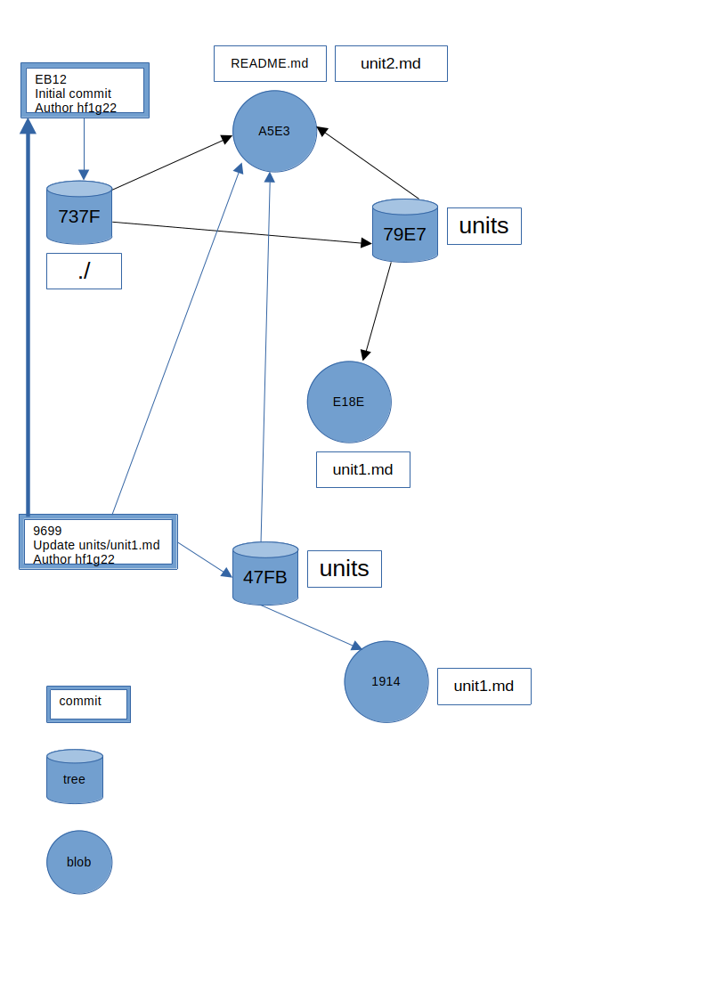

## 14. Git Internals (Optional)
The basic structure of git is a map, a table of keys and values. A value is any sequence of bytes (typically a file). The key is the hash (SHA1) of the values.
For example
```bash
$echo "Git Internals" | git hash-object 
a5e39111499f3f94302ba7fdaf3acb677491cb08
```

If we want git to store the object we use the "-w" switch. To do so we need a git repo otherwise we get an error
```bash
$echo "Git Internals" |git hash-object --stdin -w
fatal: not a git repository (or any of the parent directories): .git
```
Lets create a repo
```bash
$git init
$echo "Git Internals" |git hash-object --stdin -w
```
Where is the content stored?
```bash
$ls .git/objects
a5  info  pack
$ls .git/objects/a5
e39111499f3f94302ba7fdaf3acb677491cb08
```
the file is called a blob. It contains not only the string "Git Internals" but some header and it is compressed so we cannot read it directly.
```bash
$git cat-file a5e39111499f3f94302ba7fdaf3acb677491cb08 -t
blob
```
to show the content
```bash
git cat-file a5e39111499f3f94302ba7fdaf3acb677491cb08 -p
Git Internals

```
### How does Git track your files
Suppose we are writing a tutorial about git and git internals. We create the following directory structure
```bash
$tree
.
├── README.md
└── units
    ├── unit1.md
    └── unit2.md

```
The ```README.md``` is supposed to be a sort of table of contents but incomplete (we will see why shortly)
```bash
$cat README.md
Git Internals
$cat units/unit1.md
Introduction
$cat units/unit2.md
Git Internals
```
The content of ```README.md``` and ```units/unit2.md``` are the same on purpose.
Now create a git repo then add and commit the content.
```bash
$git init
$git status
On branch main

No commits yet

Untracked files:
  (use "git add <file>..." to include in what will be committed)
	README.md
	units/

nothing added to commit but untracked files present (use "git add" to track)
```

```bash
$git add .
$git commit -m "initial commit"
$git log
commit eb1253973ca49b519770be39f1e352c341a08495 (HEAD -> main)
Author: hf1g22 <h.farhat@soton.ac.uk>
Date:   Thu Jul 23 19:43:52 2026 +0100

    initial commit

```


We can inspect the content of the commit by using its (shortened version) hash
```bash
$git cat-file -p eb12
tree 737f4f6760e900d229607975445ac0cd24e5fee0
author hf1g22 <h.farhat@soton.ac.uk> 1784832232 +0100
committer hf1g22 <h.farhat@soton.ac.uk> 1784832232 +0100

initial commit

```
So the commit points to a "tree" object, which is basically the root directory of a snapshot of the directory structure at the time of the commit.
```bash
$git cat-file -p 737f
00644 blob a5e39111499f3f94302ba7fdaf3acb677491cb08	README.md
040000 tree 79e7a822b6bbf3f2902d8c89715c8b44e9b1b273	units

```
The first entry in each line is just the file permissions which we will ignore for now. Let us see what the subtree points to
```bash
$git cat-file -p 79e7
100644 blob e18e026a52a57735306a908392b5857dc0c48881	unit1.md
100644 blob a5e39111499f3f94302ba7fdaf3acb677491cb08	unit2.md

```
Note that the hash for ```unit2.md``` and ```README.md``` are the same since they have the same content. Now if we go back and inspect the git object type of the commit
```bash
$git log --online
eb12539 (HEAD -> main) initial commit
$git cat-file -t eb12
commit
```
So far we have seen three types of git objects: commit, tree, and blob. There is a fourth, annotated tag, which we will leave for later.

Now edit ```units/unit1.md``` by adding underlining "Introduction"
```bash
$cat units/unit1.md
Introduction
------------
$git commit -a -m "update to units/unit1"
$git log --oneline 
969905a (HEAD -> main) update to units/unit1
eb12539 initial commit

```
A visualisation of the above is show in the figure below

Let us inspect commit  ```9699```
```bash
$git cat-file -p 9699
tree 47fb267debea187f41c4d67faef59e0ff2291bbb
parent eb1253973ca49b519770be39f1e352c341a08495
author hf1g22 <h.farhat@soton.ac.uk> 1784870235 +0100
committer hf1g22 <h.farhat@soton.ac.uk> 1784870235 +0100

update to units/unit1


```
As one can see commits, usually, have parents (sometimes more than one), which allows us to track the commit history.

### Merge & Rebase

We saw how git stores objects, including commits. In this section we concentrate on operations on commits since blobs and trees handling is the same in all situations. Note that the hash of blobs and trees does not change as long as the content doesn't, whereas the hash of commits depends on the author and timestamp in addition to the message which means it almost always changes if you run the same experiment again.

We start fresh and to simplify the discussion we keep a flat directory structure so there is a single tree object.
```bash
$git init
$echo "Initial Readme" >> README.md
$git add README.md
$git commit -m "initial commit"
$git switch -c dev
$echo "added file1.txt in dev branch" >>file1.txt
$git add file1.txt
$git commit -m "added file1 in dev"
$git switch main
$echo "added file2.txt in main branch" >>file2.txt
$git add file2.txt
$git commit -m 
$git log --oneline --graph --all
* 7b19166 (HEAD -> main) added file2 in main
| * 7bc80d6 (dev) added file1 in dev
|/  
* c0be0c6 initial commit
$git merge -m "Merge branch dev" dev
$git log --oneline --graph --all

*   149ba37 (HEAD -> main) Merge branch dev
|\  
| * 7bc80d6 (dev) added file1 in dev
* | 7b19166 added file2 in main
|/  
* c0be0c6 initial commit
$git cat-file -p 149b
tree c0e29c6aa71f3af8a8b6035e30d7b3cf79504d07
parent 7b191666b49d77c83e6f2c52ba3c705b22577a1b
parent 7bc80d64536dd764b776c32db8e09af9ee0ec2c3
author hf1g22 <h.farhat@soton.ac.uk> 1784883213 +0100
committer hf1g22 <h.farhat@soton.ac.uk> 1784883213 +0100

Merge branch dev

```
Note that the merge commit has two parents and its content is the "merger" of the two.

Now lets try rebase. 
```bash
$git log --online --graph --all
*   149ba37 (HEAD -> main) Merge branch dev
|\  
| * 7bc80d6 (dev) added file1 in dev
* | 7b19166 added file2 in main
|/  
* c0be0c6 initial commit
$git reset --hard main~1
$git rebase dev
$git log --oneline --graph --all
* 3ca4831 (HEAD -> main) added file2 in main
* 7bc80d6 (dev) added file1 in dev
* c0be0c6 initial commit

```
As you can see the git history does not reflect the "actual" history.
