## Learning Outcomes

By the end of this session, students will be able to:

1. Explain what Continuous Integration (CI) is and why it matters in software engineering.
2. Create and customize a GitHub Actions workflow to run tests automatically.
3. Use matrices and caching, to speed up and standardise builds.
4. Protect `main` using required checks and PR rules.


## Why Continuous Integration?

- Catches integration errors early (small, frequent, automated).
- Creates reproducible builds and standardised environments.
- Provides fast feedback loops for developers.
- Enforces quality gates: only “green” builds merge to `main`.

---

## GitHub Actions Concepts

- **Workflow:** YAML file under `.github/workflows/` triggered by an **event**.
- **Jobs:** Run on **runners** (e.g., `ubuntu-latest`).
- **Steps:** Shell commands or **actions** (from the marketplace).
- **Contexts:** `${{ github.* }}` and `${{ runner.* }}` for metadata.

---

###  Events, Runners, Marketplace

- **Events:** `push`, `pull_request`, `schedule` (cron), `workflow_dispatch` (manual), path filters.  
- **Runners:** GitHub-hosted (Linux/Windows/macOS) or self-hosted.  
- **Marketplace Actions:**  
  - `actions/checkout`  
  - `actions/setup-<lang>`  
  - `actions/cache`  
  - `actions/upload-artifact`

---


## 8. Setup
First login to Github and create a **new public** repo and name it ```python-ci```. The url for that repo will be ```https://github.com/your-account/python-ci```. Then open ```git-bash``` and execute the following commands

```bash
$git clone https://github.com/hikmatfarhat-ndu/python-ci
$cd python-ci

```
This clones my repo into your local computer. The repo has two python files:```add.py``` and ```test_add.py```.

**add.py**
```python 
def add(x: int, y: int) -> int:
    """Returns the sum of two integers."""
    return x + y
```


**tests_add.py**
```python
from add import add
import pytest
def test_add():
     assert add(2, 3) == 5
     assert add(-1, 1) == 0
def test_add_type_error():
    with pytest.raises(TypeError):
        add(2, 3.3)

```

It also contains the file the Github workflow ```.github/workflows/python-ci.yml```

### 9. Github Actions

GitHub Actions are workflows that automatically run when certain events happen in your repository — like when you push commits. Workflows are saved in YAML format in the repository in the directory ".github/workflows". In your favorite editor open the file below:

### Minimal CI Workflow (`.github/workflows/python-ci.yml`)
```yaml
name: Python application

on: push

jobs:
  build:
    runs-on: ubuntu-latest
    steps:
      - name: Checkout
        uses: actions/checkout@v4

      - name: Set up Python
        uses: actions/setup-python@v5
        with:
          python-version: "3.10"

      - name: Install dependencies
        run: |
          python -m pip install --upgrade pip
          pip install pytest
          if [ -f requirements.txt ]; then pip install -r requirements.txt; fi
      - name: Run tests
        run: pytest -q
```
First what triggers the execution of that script. In this case when a commit is **pushed** into the repository.
Other possible events `pull_request`, `schedule`, `workflow_dispatch` (manual).

Next is a list of jobs to run when the script is triggered. In this case we have only one, **build**. Each job is a sequence of steps, and each step could be a predefined action in the **marketplace** or some command (or a sequence of commands). 

Since the job is usually executed on a **runner** which is not the same system where the repository is stored we need action **checkout**. This action clones the repository into the runner system and checks out the commit that triggered the action. 

Next ```setup-python``` is an action that installs and configures Python. Even though runners come with Python preinstalled this action guarantees the exact Python version is correctly setup on the runner.

"Install dependencies" is a sequence of shell commands that ensure all the python packages we need are installed.

Finally, "Run tests" executes ```pytest```.

To proceed, you need to upload the local content to your newly created repo.

```bash
$git remote set-url origin  < your Github repo url >
$git push -u origin main
```
Because of the **push** the local files are uploaded to your Github repo. Furthermore, if you click on the "Action" tab you will see the below:

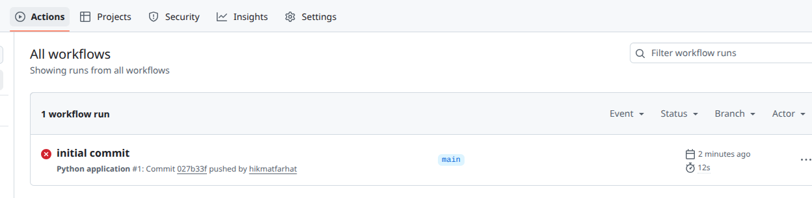

The workflow failed because **add.py** failed one of the **tests**, namely, failed to raise an exception when the arguments were not integers.
Open ```add.py``` in your favorite editor and replace the code with the one below.
```python
def add(x: int, y: int) -> int:
    if not isinstance(x,int) or not isinstance(y,int):
     raise TypeError("Both arguments must be integers")
    """Returns the sum of two integers."""
    return x + y
```
After saving the changes, commit and push the changes.
```bash
$git commit -a -m "added argument check to function add"
$git push
```
If we check the actions tab now it will look something like
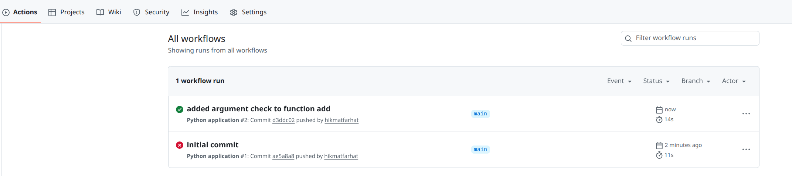

As you can see the second run of the action is successful.


### 10. Protecting the main branch

Typically, the main branch of a repository has working and well-tested code. One way to ensure that, is to disallow direct commits into the the main branch. It works as follows:
1. commit new code to a separate branch, say **dev**
2. create a pull-request (meaning a merge request) to incorporate the changes in **dev** into main
3. The merge will be executed **only if** the code passes specific tests, e.g. the Github action ran successfully.

To protect the main branch:
1. Select the **settings** tab
2. On the left pane select **Branches**
3. Click on **Add branch ruleset**
4. Give it a name, say "protect main"
5. set "Enforcement status" to **Active**
6. In the target branches section add **Include default branch**
7. Under branch rules, tick: **Require a pull request before merging**. Don't tick any other "additional settings" for now
8. Push the "create" button at the bottom of the page.

We can test the above configuration as follows. First comment out the part in **add.py** that checks the parameters type.
```python
def add(x: int, y: int) -> int:
   # if not isinstance(x,int) or not isinstance(y,int):
   #    raise TypeError("Both parameters must be integers.")
    """Returns the sum of two integers."""
    return x + y
```
Then 
```bash
$git commit -a -m "commented out raise TypeError"
$git push
```
The push will fail and we get something like
```
remote: error: GH013: Repository rule violations found for refs/heads/main.
remote: Review all repository rules at https://github.com/hikmatfarhat/python-ci/rules?ref=refs%2Fheads%2Fmain
remote: 
remote: - Changes must be made through a pull request.
remote: 
To https://github.com/hikmatfarhat/python-ci
 ! [remote rejected] main -> main (push declined due to repository rule violations)
error: failed to push some refs to 'https://github.com/hikmatfarhat/python-ci'

```
The proper way is to create a development branch, say **dev**, and commit the changes there. Once we are satisfied, we merge with **main**. 

First we roll back the last commit using reset (this is safe to do because the upstream refused the commit).
```bash
$git reset --hard main~1
$git checkout -b dev
"comment out the type check as before"
$git commit -a -m "commented out raise TypeError"
$git push -u origin dev 
```
Visiting the main repo page we see something like this
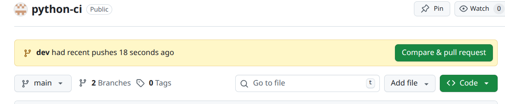

Push the "Compare & pull request" button, then "create pull-request". You will see that the check (Github action) has failed, which is expected, but we can still merge (the button "Merge pull-request" is active). This is because we did not require the workflow to be successful as a condition. Go ahead and push it to merge dev into main. Then, on your local machine
```bash
$git checkout main
$git pull
```
Despite the fact that the workflow check failed we were able to merge **dev** into **main**. We can prevent this from happening by checking "Require status check to pass" in the "protect main" ruleset, and adding "build" job in our workflow as shown in the figure below.
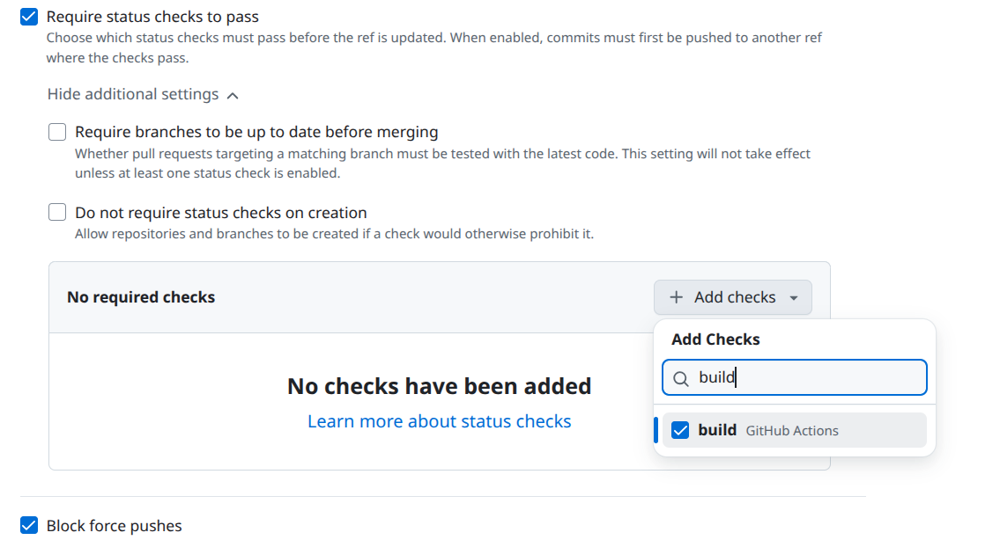

To test the new rule, add an empty line at the end of "add.py" in branch dev and commit
```bash
$git checkout dev
"add empty line at the end of add.py"
$git commit -a -m "added empty line"
$git push
```
Go to the repository's main page and select the **dev** branch
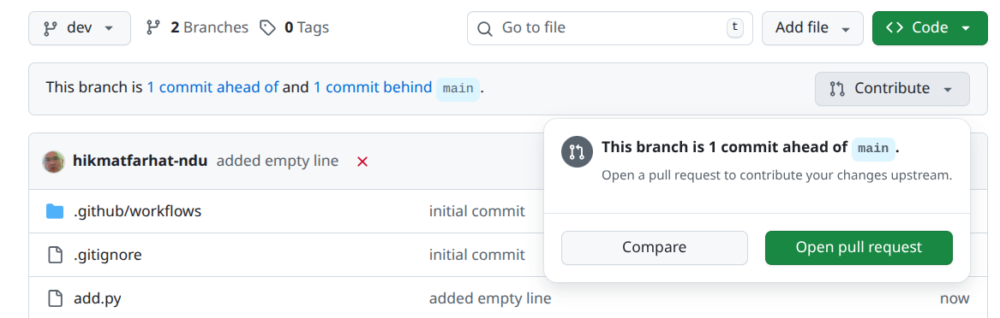
Click on "Contribute->Open pull request" and then "create pull-request". 
Note that now the "Merge pull request" button is not active: the **dev** commit MUST pass the check to be merged into main.

To pass the test, remove the comments around the testing of parameters. Then
```bash
$git commit -a -m "uncommented the raise TypeError"
$git push
```
Now we can perform the merge because the commit passed the required workflow. Note that the pull request was still open.


## 11. Code review
Another option that is widely used is to block merges into main unless the code is reviewed by another developer or team leader.
Go to "Settings->Collaborators" and add another Github account ("Add people"), for example the person sitting next to you in the lab. They should check their inbox as shown in the figure below and **accept** the invitation.

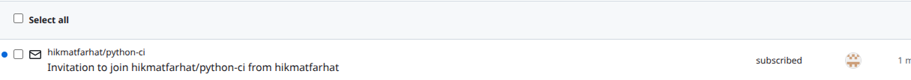
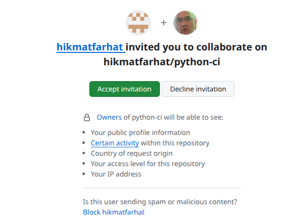

Edit the "protect main" ruleset and under "require a pull request before merging -> required approvals" select 1 and save.
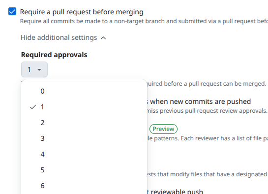

Now go back to branch **dev** and add a new function integer division function to ```add.py```
```python
def add(x: int, y: int) -> int:
    if not isinstance(x,int) or not isinstance(y,int):
       raise TypeError("Both parameters must be integers.")
    """Returns the sum of two integers."""
    return x + y
def div(x:int,y:int)->int:
    return x//y
```
```bash
$git commit -a -m "implemented integer division"
$git push
```

Create a pull-request as before but in this case you get something similar to the below
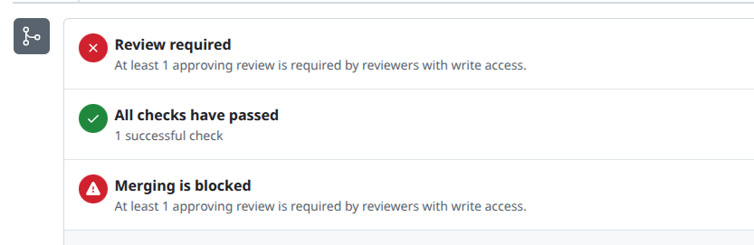
Even though the workflow succeeded you cannot merge into main because a review is required. Your collaborator can review your code. They can do this by visiting your repo and select the "Pull request" tab

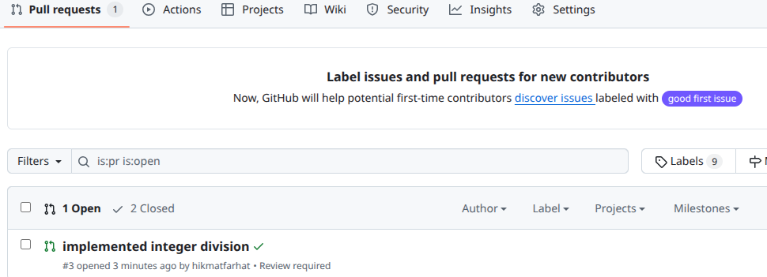
And then selecting the "Files changed" tab.
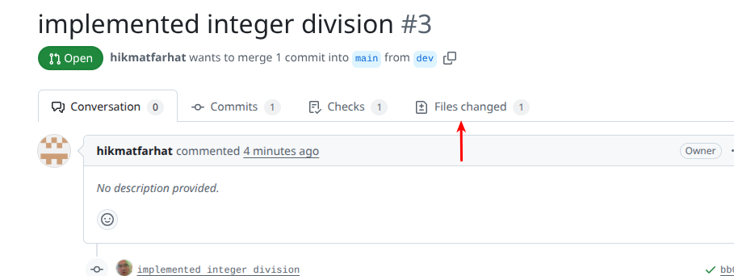
Next they can review the code changes by pressing the "Review Changes" button.
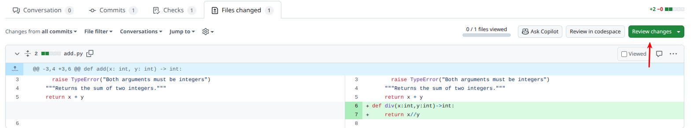
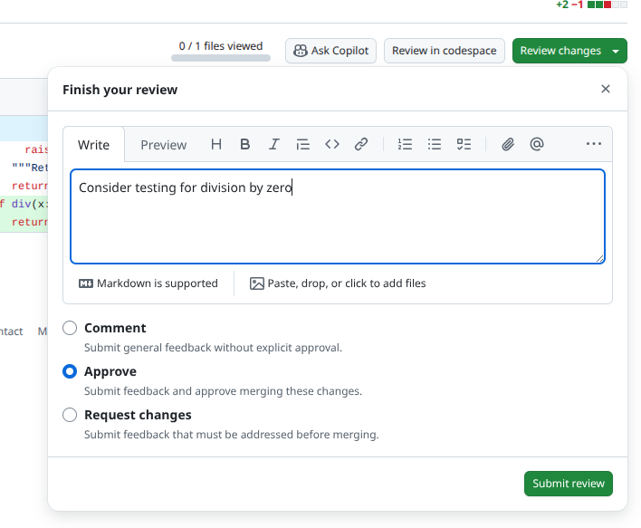
They can comment,request changes or approve. In all cases they can leave a comment but only if they approve you can merge the changes.


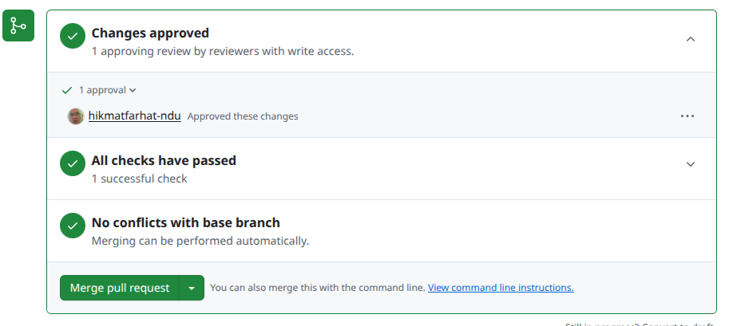
Note that your collaborator can also perform "Merge pull-request".
After you merge the pull request **Disable** the ruleset "protect main" to proceed.
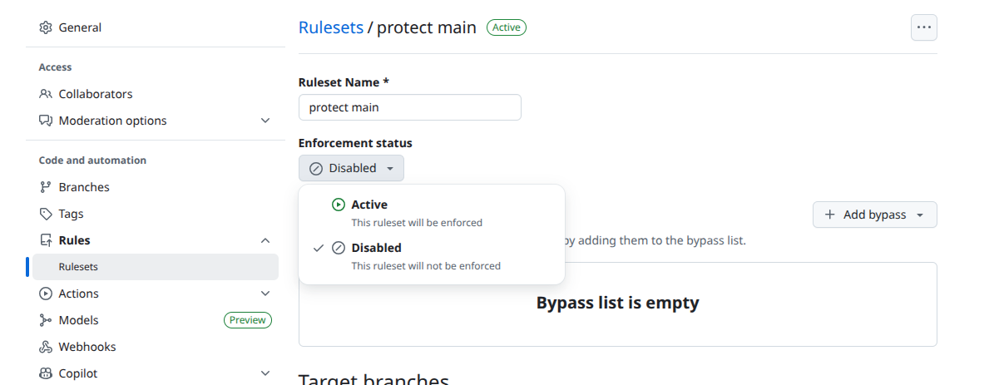


### 12. Caching

The trivial Python code we are using in our examples does not require any dependencies. Typical production code depends on other packages which are installed by, for example, ```pip``` using a ```requirements.txt``` file.

```bash
$pip -r requirements.txt
```
Such operations - downloading and installing packages- consume a lot of computation power and network traffic. Since the whole idea of CI is based on running the workflows often, we can speed-up those operations by caching. The ```req.txt``` file in the directory was designed to install very large (and totally not needed) packages to show the difference that caching makes.
So far, the workflow has skipped the installation step because the ```if``` statement looks for ```requirement.txt```.

To test the effect of **caching**, copy the code below and paste it before the "the test with pytest" part in the ```.github/workflows/python-ci.yml``` file . Make sure the indentation is correct, otherwise you will get errors.
 ```yaml
- name: Cache pip
        uses: actions/cache@v4
        with:
          path: ~/.cache/pip
          key: ${{ runner.os }}-pip-${{ hashFiles('**/requirements*.txt') }}
          restore-keys: ${{ runner.os }}-pip-
 ```
Also, rename the file ```req.txt``` to ```requirements.txt```, then commit and push the changes.
Switch to the "Actions" tab and wait for the workflow run to finish and note the time it takes (a few minutes). 
To compare the performance of caching, edit the ```add.py``` file by adding an extra empty line at the end, commit and push.
### Explanation
- The ```actions/cache@v4``` is the script that handles caching. 
- The path is where the cache file is unpacked if found.
- The key is the most important part. It is a value used to search for the cached file. It is clear from the above that it is composed of (in this case) "Linux-latest" followed by "pip" followed by the hash of the "requirements" files. It is worth explaining the pattern "**/requirement*.txt"
  - "**/" matches any directory at any depth including depth 0.
  - "requirements*.txt" matches any file in those directories that starts with "requirements" and ends with ".txt"
- The restore-keys is a fallback mechanism in case no exact match is found. 


### 13. Testing multiple Python versions and OS

In many situations we would like to test our code against multiple versions of Python and/or different operating systems. This can be done by using the "strategy/matrix" in Github actions.


```yaml
jobs:
  build:
    
    strategy:
      matrix:
        os: [ ubuntu-latest, windows-latest ]
        python-version: [ "3.10","3.11" ]
    runs-on: ${{ matrix.os }}

  - name: Set up Python
      uses: actions/setup-python@v5
      with:
        python-version: ${{matrix.python-version}}
  - name: Cache pip
      uses: actions/cache@v4
      with:
        path: ~/.cache/pip
        key: X-${{ runner.os }}-pip-${{ hashFiles('**/requirements*.txt') }}
        restore-keys: X-${{ runner.os }}-pip-      
  - name: Install dependencies
      shell: bash
      run: |
        python -m pip install --upgrade pip
        pip install pytest
        if [ -f requirements.txt ]; then pip install -r requirements.txt; fi
```
To save unnecessary computation time, rename "requirements.txt" to "req.txt" and prefix the cache hash with, say, "X" as shown above, to skip package installations and cache retrieval.
Since windows runners use power shell by default the statement ```if [ -f requirements.txt]...``` will cause an error. That is why we added ```shell: bash``` in the "Install dependencies" step.
After editing the workflow file, commit and push. When the run complete you can see that 4 different runs were completed.

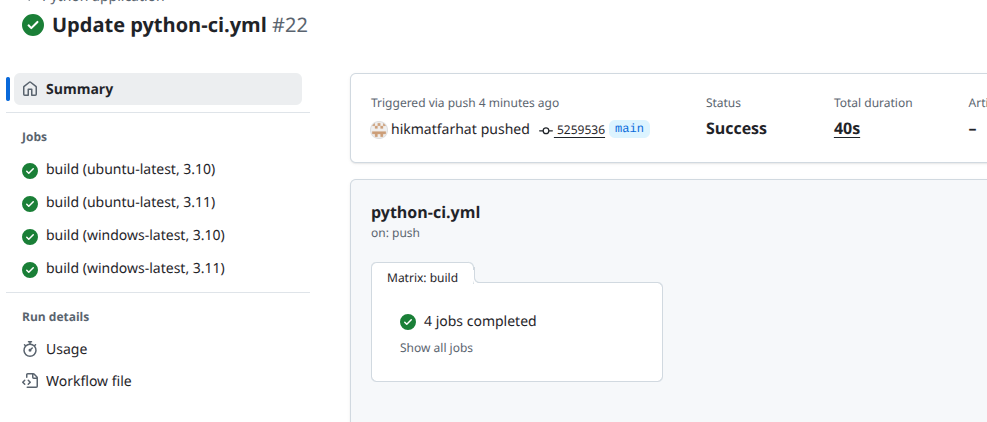


 
