# GIT

On your local computer open a Unix shell. 
- On Windows open "Git Bash" to get a Unix shell. 
- On Linux open a terminal. 
- Type the following commands:
```bash
$git config --global user.name <Your Name>
$git config --global user.email <Your Email>

```
- Your name and email will be used to identify who performed the commits.
---
 - We will need two sibling directories (folders)  "git" and "git-tmp".
 - "git" will be created for you when you clone the remote repository. 
 - Create "git-tmp" explicitly using ```mkdir```.
 - Most of the work will be in "git-tmp".  

```bash
$git clone https://github.com/hikmatfarhat-ndu/git/
$mkdir git-tmp
```
- `git` contains many files, for example the file you are reading, and .
- `create_git.sh`, is a script 
-  It allows you to reproduce the steps in case you made a mistake. 
 ---

- For example, to execute all the steps up to and including section 3
```bash
$cd git-tmp
$../git/create_git.sh 3
```
- assuming ```git``` and ```git-tmp``` are sibling directories:
- For now we will do all the steps manually.

---

## 1. Basics
- Git is used to keep track of all your work. 
- It saves a sequence of "snapshots" or versions of your files. 
- A version of a file can be in one of three places as show in the figure :
- **working directory**, **staging area**, or **git** directory
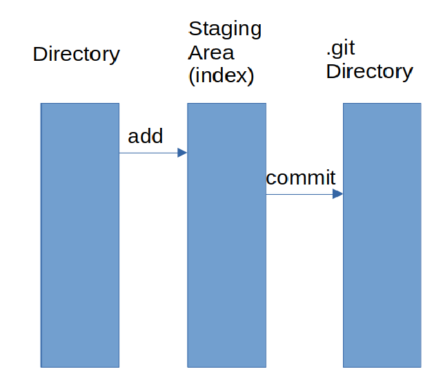

---

- The **working directory**: the files and folders that reside on your filesystem. 
- You can view the content using file explorer.
- The staging area is a file kep by Git, stores information about what will go into your next snapshot (commit).
- The git directory contains a complete history of all your saved(committed) snapshots and relation between them.

- The figure shows the typical commands that are used to move a version of a file between the three stages.
- The working directory and staging area contain only one version of a given file. 
- The git directory, can contain multiple versions of the file.

---

- The working directory contains the files that you are working on. 
- The staging area (index) contains information on what **will be** in the next commit.
- A typical workflow would be:
1. Modify files in the working directory
2. "add" the modified files to the staging area
3. "commit" the files in the staging area to the local git repository (directory)

--- 
<!-- ### 1.1 Initialization -->

- To start git tracking, first we initialise the directory to be under version control.

- We start with an example. Open a terminal (Linux) or "Git bash" (Windows) and ```cd```  (change directory) to folder "git-tmp". 

```bash
$cd git-tmp
$git init
$git status
On branch main
No commits yet
nothing to commit (create/copy files and use "git add" to track)
```
**Note**: depending on the version of git the initial branch could be called "master" instead of "main". If this is the case change its name to "main" using ```git branch -m main```. 
Now create a new file, ```file1.txt```
```bash
$echo "first version of file1" > file1.txt
$git log
fatal: your current branch 'main' does not have any commits yet
$git status
On branch main
No commits yet
Untracked files:
  (use "git add <file>..." to include in what will be committed)
        file1.txt

nothing added to commit but untracked files present (use "git add" to track)
```
---
At this point file1.txt is newly added to the working directory, so it is **untracked**. To start **tracking** it, we add it to the index using the **add** command.

```bash
$git add file1.txt
$git status
On branch main
No commits yet
Changes to be committed:
  (use "git rm --cached <file>..." to unstage)
        new file:   file1.txt
```
- now there are two (identical) copies of file1.txt
- in the **working** directory and in the **index**. 
- If we make changes to `file1.txt` they will affect the one in the **working** directory only. 
--- 
- Edit `file1.txt`, by adding the line "second version of file1".
(**note** the difference between ```>```, overwrite, and ```>>```, append ). 
- Of course you can edit the files using any editor, but using `echo` and redirection allows us to automate the operations.

```bash
$echo "second version of file1">>file1.txt
$git status
On branch main
No commits yet
Changes to be committed:
  (use "git rm --cached <file>..." to unstage)
        new file:   file1.txt

Changes not staged for commit:
  (use "git add <file>..." to update what will be committed)
  (use "git restore <file>..." to discard changes in working directory)
        modified:   file1.txt
```
--- 

- At this point the version in the **working** directory and the **index** are **different**.
- We can either add the second version to the **index**, (and later  **commit**), 
- or restore the version in the index (that contains one line only) to the working directory. Let us try the last option.
```bash
$cat file1.txt

first version of file1
second version of file1

$git restore file1.txt
$cat file1.txt
first version of file1
$git status
On branch mains
No commits yet
Changes to be committed:
  (use "git rm --cached <file>..." to unstage)
        new file:   file1.txt

```
--- 

- Our next action is to commit the content of the **index** (staging area).
```bash
$git commit -m "added first version of file1"
$git status
On branch main
nothing to commit, working tree clean
```
Next we add the line "second version of text1" to file1.txt, add it to the index then add "third version" to file1. 
```bash
$echo "second version of file1">> file1.txt
$git add file1.txt
$echo "third version of file1">> file1.txt
```
---
- At this point we have **three** versions of file1.txt (as shown in the figure below):

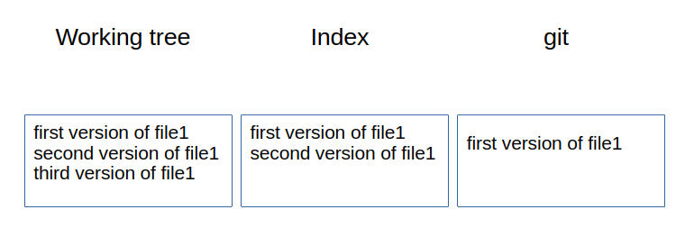

- one in the working directory (3 lines)
- one in the index (2 lines)
- one was committed (1 line) 
---

We can compare the difference between the three versions using the **diff** command.
First we show the difference between working tree and index.

```bash
$git diff
diff --git a/file1.txt b/file1.txt
index 0005eef..73c2f46 100644
--- a/file1.txt
+++ b/file1.txt
@@ -1,2 +1,3 @@
 first version of file1.txt
 second version of file1.txt
+third version of file1.txt
```

The above says that the version in the working tree (b) has an extra line "third version of file1.txt" which doesn't exist in the index (a).
In general, a line preceded with '-' means it is in ```a``` but not in ```b``` and '+' it is in ```b``` not in ```a```.
---

- We can also show the difference between working tree (b) and the last commit (a).

```bash
$git diff HEAD #or git diff master or main 
               # depending on the name of the branch

diff --git a/file1.txt b/file1.txt
index 7436323..73c2f46 100644
--- a/file1.txt
+++ b/file1.txt
@@ -1 +1,3 @@
 first version of file1.txt
+second version of file1.txt
+third version of file1.txt
```
---

- Finally, we can show the difference between the index (b) and the last commit (a) (or any specified commit)
```bash
$git diff --cached 
diff --git a/file1.txt b/file1.txt
index 7436323..0005eef 100644
--- a/file1.txt
+++ b/file1.txt
@@ -1 +1,2 @@
 first version of file1.txt
+second version of file1.txt
```
---
### Summary
```git diff --cached``` 
shows the difference between the **index** (b) and last commit (a).

```git diff``` shows the difference between **working directory** (b) and **index** (a)

```git diff commit``` shows the difference between working directory (b) and a commit (a)

Next we will be committing the three different version of ```file1.txt```.


```bash
$git commit -m "added second version of file1"
# at this point the version in the index and the last commit are the same. You can check using diff
$git add file1.txt
$git commit -m "added third version of file1"
$git log --oneline
* 99365ba (HEAD -> main) added third version of file1
* 880be99 added second version of file1
* d039f56 added first version of file1
```
---
### Commit hashes
- ```$git log``` gives us the "history" of our changes. 
- So far our work contains a single file but usually each commit stores a **complete snapshot** of the whole working directory, not just the differences. 
- Currently we have three different versions of our working directory (which contains file1.txt only)
- each with an associated hash of  160 bits (40 hex digits) for reference. 
- The `--oneline` switch shows the first 7 hex digits and sometimes more.

**Note**: you will get different values for the hashes because the hash includes the author of the commit and the timestamp (try ```git log``` to see the full information). 

---

- To compare the working directory with the first commit (i.e. d039f59) we can use 
```
$git diff d039f56
```
- commit hashes depend, among other things, on the timestamp
- they have different values even if we repeat the same sequence of commands. 
- Instead we use the symbolic reference ```main~2``` which means two commits relative to ```main```. 
**Note** that at this point there is no difference between the working directory and the commit pointed to by ```main```.

--- 

```
$git diff main~2
diff --git a/file1.txt b/file1.txt
index cdfc58c..ff2bf31 100644
--- a/file1.txt
+++ b/file1.txt
@@ -1 +1,3 @@
 first version of file1
+second version of file1
+third version of file1

```
---

- Similary, we can compare the working directory with the penultimate commit:

```
$git diff main~1
diff --git a/file1.txt b/file1.txt
index 3e3d539..ff2bf31 100644
--- a/file1.txt
+++ b/file1.txt
@@ -1,2 +1,3 @@
 first version of file1
 second version of file1
+third version of file1

```
<!-- 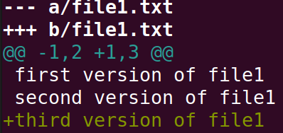 -->
---

## 2. Branching

- To work on a new feature in a software base we create a new branch from the main one. 
- This way all the changes we make do not affect the "working code". 
- But after we are done developing the new feature, we would like to incorporate  the new changes back into the main part. 

<!-- Before we proceed we perform two commits to get three different versions of file1.txt in the database. -->
---

- A simple branching example. 

```bash
$git branch -c dev # create a new branch dev
$git switch dev
$git branch
* dev
  main
$git log --oneline --graph --all
* 99365ba (HEAD -> dev, main) added third verison of file1
* 880be99 added second versio of file1
* d039f56 added first version of file1

```
- Notice that in the above output HEAD is pointing to dev.
--- 


- On branch dev we add a new file, ```file2.txt```
- then make a second version of file2.txt.

```bash
$echo "first version of file2"> file2.txt
$git add file2.txt
$git commit -m "first version of file2"
$echo "second version of file2">> file2.txt
$git commit -a -m "second version of file2"
```
- If a file is **already tracked**, one can combine ```add``` with ```commit```
- Using `-a -m` 
---

- Switch back to branch main and create a new file, ```file3.txt``` 
- Then a second version of file3.txt

```bash
$git switch main
$echo "first version of file3"> file3.txt
$git add file3.txt
$git commit -m "first version of file3"
$echo "second version of file3">> file3.txt
$git commit -a -m "second version of file3"
```
---

```bash
$git log --oneline -graph --all
* 726033c (HEAD -> main) second version of file3
* 1633b27 first version of file3
| * 386477c (dev) second version of file2
| * 2c92335 first version of file2
|/  
* 71677f6 added third verison of file1
* 85edc50 added second version of file1
* 8785ab7 added first version of file1

```
- We now have two **divergent**, but separate, branches.
<!-- 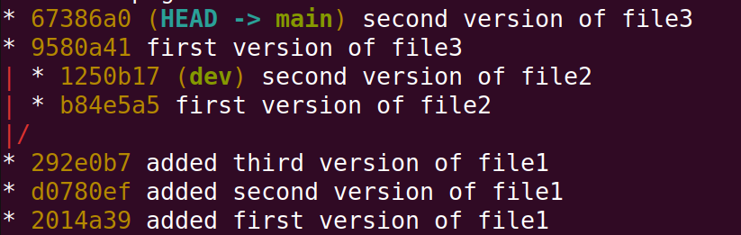 -->
---


## 3. Merging 
 
 - Now we want to incorporate the changes into main. 
 - We make sure first that we are "on" branch main.

```bash
$git switch main
Already on 'main'
$git merge dev
```
- A default editor will open with a default message "Merge branch 'dev'".
- We can change the message then save and quit.
--- 

```bash
$git log --oneline --graph --all
*   1bb3836 (HEAD -> main) Merge branch 'dev'
|\  
| * b239df6 (dev) second version of file2
| * e9a2542 first version of file2
* | 49ebadd second version of file3
* | d0016b8 first version of file3
|/  
* abd9b58 added third verison of file1
* b2a304d added second version of file1
* 711c3b6 added first version of file1

```
<!-- 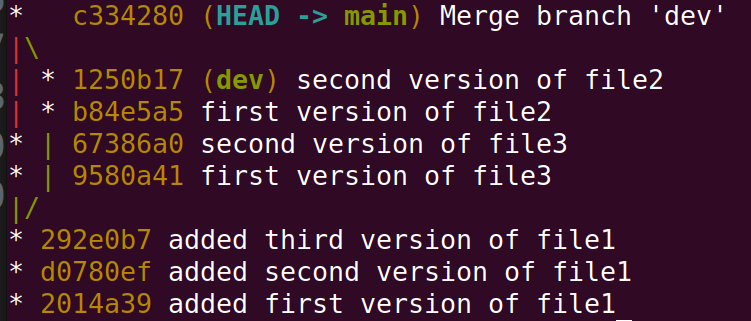 -->
At this point branch main contains all the changes made in dev (note that file2.txt was created and modified on branch dev only)
```bash
$ls
file1.txt  file2.txt  file3.txt
```
---
## 4. Handling merge conflicts

- The merging operation went smoothly because we made sure not to change a file common between branches.
- If there are different versions of the same file, `git` does not know which one to choose
- It is up to us to decide. 
- Next we will try to merge two branches where ```file2.txt``` changed in both. 
- But first, we get **dev** up to date with **main**. 
```bash
$git switch dev
$git merge main # get dev up to date with main
```
- Note that since **dev** is an ancestor of **main** merge just updates **dev** to point to the same commit as **main**. 
- In git jargon this is called "fast-forward".
---
- Make changes that create a conflict
```bash
$echo "added lines on dev" >> file2.txt
$echo "changed on dev">>file2.txt
$git commit -a -m "changed file2 on dev"
$git switch main
$echo "changed on main">> file2.txt
$git commit -a -m "changed file2 on main"
$git merge dev
Auto-merging file2.txt
CONFLICT (content): Merge conflict in file2.txt
Automatic merge failed; fix conflicts and then commit the result.
```

`git` is telling us that it cannot perform the merge because there is a conflict between the two versions. 
---

```bash
$git status
On branch master
You have unmerged paths.
  (fix conflicts and run "git commit")
  (use "git merge --abort" to abort the merge)

Unmerged paths:
  (use "git add <file>..." to mark resolution)
        both modified:   file2.txt

no changes added to commit (use "git add" and/or "git commit -a")
```
---

But it also tells us where the conflict is
```bash
$cat file2.txt
first version of file2
second version of file2
<<<<<<< HEAD
changed on main
=======
added lines on dev
changed on dev
>>>>>>> dev

```
- The part between `<<<<<<<HEAD` and `=======` is in **main** but not in **dev** 
- and between  `=======` and `>>>>>>>dev` is in **dev** but not in **main**.
---

- We can choose the version we want (or both) by editing the file, then commit. 
- In this case, we remove the line "added lines on dev" and the separator lines (with '<<<<<HEAD','=========','>>>>>>>>>>>>dev').
```bash
$cat file2
first version of file2
second version of file2
changed on main
changed on dev
```
---
Then add/commit the changes.
```bash
$git commit -a -m "fixed merge conflict on file2"
$git log --oneline --graph --all
*   56473e8 (HEAD -> main) fixed merge conflict on file2
|\  
| * 74b7640 (dev) changed file2 on dev
* | dbadf76 changed file2 on main
|/  
*   1bb3836 Merge branch 'dev'
|\  
| * b239df6 second version of file2
| * e9a2542 first version of file2
* | 49ebadd second version of file3
* | d0016b8 first version of file3
|/  
* abd9b58 added third verison of file1
* b2a304d added second version of file1
* 711c3b6 added first version of file1

```
---
<!-- 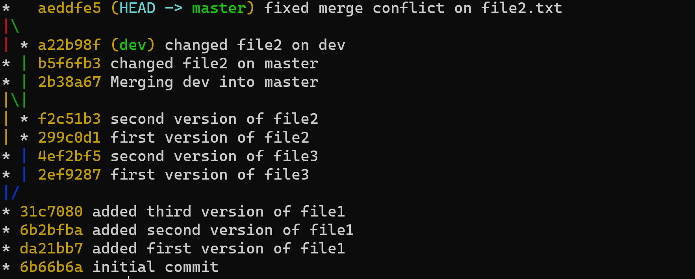 -->

<!-- After merging, we need to keep 'dev' update to date with 'main'.
```bash
git checkout dev
git merge main
```
Note the 'Fast-forward'. This is because,before the last merge, dev pointed to an ancestor of 'main' which means 'main' already incorporated everything in 'dev' so the dev pointer is just advanced to point to main. -->
## 5. Undoing commits

- Suppose that we made a mistake in merging and we want to undo it. 
- The safest way to undo commit(s) is to use `revert`. 
- This command will undo commits by 'creating reverse commits'.
- First we can inspect the content of ```file2.txt```  before and after the merge. 
- After the merge:
```bash
$cat file2.txt
first version of file2
second version of file2
changed on main
changed on dev
```
---
- Using `git log` we see that the last commit, on **main**, before merge is `main~1` (or you can use the hash explicitly)
```bash
$git checkout  main~1 
$cat file2.txt
first version of file2
second version of file2
changed on main
$git checkout main # go back to main
```
---

Alternatively, we can view the difference between the two version
```bash
git diff main main~1

--- a/file2.txt
+++ b/file2.txt
@@ -1,4 +1,3 @@
 first version of file2
 second version of file2
 changed on main
-changed on dev

```
---

Next we "revert" the last commit.
```bash
$git switch main # make sure we are on main
$git revert HEAD 
error: commit 56473e8.... is a merge but no -m option was given.
fatal: revert failed
```
- The error we got is due to the fact that the last commit (56473e8) has two parents
- we need to specify which parent to 'revert' to.
```bash
$git revert -m 1 HEAD 
$ls
file1.txt  file2.txt  file3.txt
$cat file2.txt
first version of file2
second version of file2
changed on main
```
---
```bash
$git log --oneline --graph --all
* 148a89c (HEAD -> main) Revert "fixed merge conflict on file2.text"
*   56473e8 fixed merge conflict on file2.text
|\  
| * 679fca2 (dev) changed file2 on dev
* | 82d531c changed file2 on main
|/  
*   64809ab Merge branch 'dev'
|\  
| * 83d1d58 second version of file2
| * 16cb9e7 first version of file2
* | 1507554 second version of file3
* | 8adf8b4 first version of file3
|/  
* b2b134f added third version of file1
* f9b5445 added second version of file1
* c41ee90 added first version of file1

```
<!-- 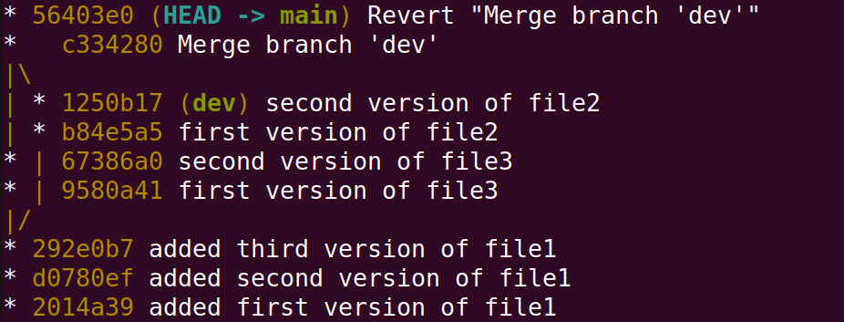 -->
---
One can check that indeed HEAD and HEAD~2 have the same snapshot by using diff ```git diff HEAD main~2```

(**Caution**: as you can see from the above graph branch dev is now an ancestor of main so ```git switch dev;git merge main``` will fast-forward dev to main)

**Note**: unlike revert, when doing `git checkout` and `git diff` we do not need to specify which parent? (lookup how ~ works)

---
### Reset

- Another way of undoing commits is to use ```reset```. 
- When we resolved the the previous merge conflict we removed the line "added lines on dev" and kept the line "changed on dev". 
- Suppose that it was a mistake and we should have done the opposite. 

- The problem  here is that branch dev points to a commit that is an ancestor of the commit pointed to by main, so ```git switch dev;git merge main``` will not change the contents of file2. 
- Instead we point main to the commit that we want, in this case to ```main~2```.
- be **cautious** in using reset since it alters the history, especially if you are using a remote server.
---

```bash
$git reset --hard main~2
$git log --oneline --graph --all
* 0f43545 (dev) changed file2 on dev
| * fcc0bc8 (HEAD -> main) changed file2 on main
|/  
*   e680917 Merge branch 'dev'
|\  
| * 39ea67d second version of file2
| * 2876b02 first version of file2
* | 883cf54 second version of file3
* | d8e60ba first version of file3
|/  
* e50bdd0 added third verison of file1
* 70fe52b added second version of file1
* d27b827 added first version of file1

```
---
<!-- 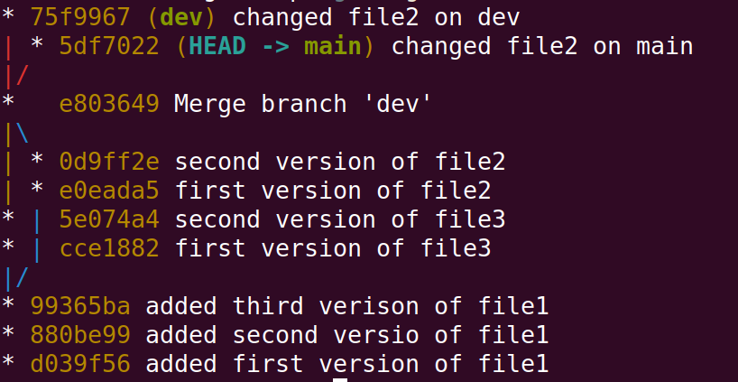 -->
Let us do the merge again, but this time  keeping "added lines on dev" and removing "changed on dev".

```bash
$git merge dev 
Auto-merging file2.txt
CONFLICT (content): Merge conflict in file2.txt
Automatic merge failed; fix conflicts and then commit the result.
# after editing as described above
$cat file2.txt
first version of file2
second version of file2
changed on main
added lines on dev

$ git commit -a -m "re-fixed conflict" 
```
---

<!-- ## 5. Rebase
Rebase allows us to change the **base** of a sequence of commits. We will execute the same sequence as before but use rebase instead of merge. You don't have to redo things manually, run the script ```??``` and it will get you to ???

Starting from an empty working directory we do  some commits on the master branch.
```bash
>echo "first line">file1.txt
>git init
>git add file1.txt
>git commit -m "1st master"
>echo "second line">>file1.txt
>git commit -a -m "2nd master"
>echo "third line">>file1.txt
>git commit -a -m "3rd master"
>git log --oneline

```
The commit history will look something like this.
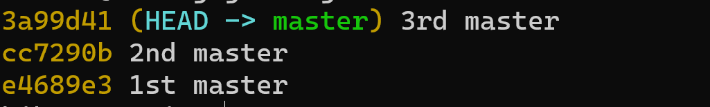
Then we create a **dev** branch and add some commits to it.

```bash
>git checkout -b dev
>echo "file2">>file2.txt
>git add file2.txt
>git commit -m "1st dev"
```
Then switch back to master and add some commits.
```bash
>git checkout master
>echo "4th line">>file1.txt
>git commit -a -m "4th master"
>echo "5th line">>file1.txt
>git commit -a -m "5th master"
```
The history will look something like this.
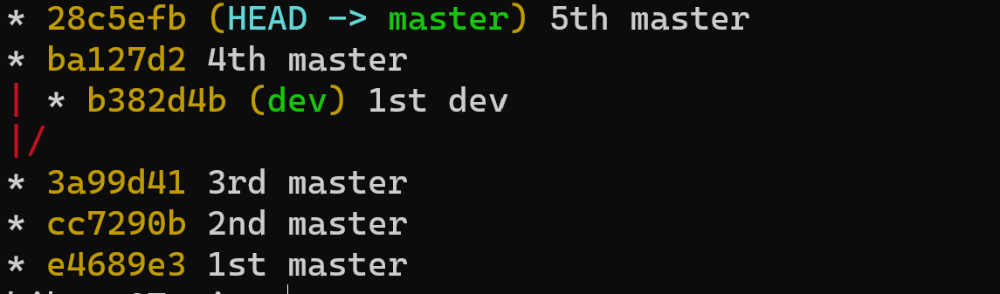

The common  ancestor of both branches is the commit 3a99d41 which as far as git is concerned is the **base** of branch dev.
```bash
>git checkout dev
>git rebase master
>git log --oneline --graph --all
```
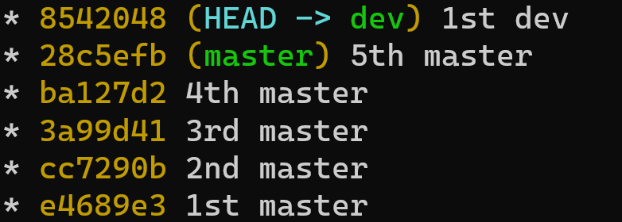
Basically, we are telling git to use master as a base for which to add all the commits of the dev branch since it branched out from master.
Another way to look at it is to use master as a base for commits from 3a99d41 to dev where 3a99d41 is automatically detected by git as the common ancestor of the two branches.


### Cleaning up history

Sometimes the log becomes very long and we would like to get rid of the earlier commits. We can do that using rebase as follows. First we create an "orphan" branch were we want the new history to start.
First we remove the dev branch.
```bash
>git branch -D dev
```
Then 
```bash
>git checkout --orphan temp 3b360f5
>git commit -m "new initial commit"
```
Next we rebase the sequence of commits 3b360f5 to master from the new orphan branch
```bash
>git rebase --onto temp 3b360f5 master
>git log --oneline --graph --all
```
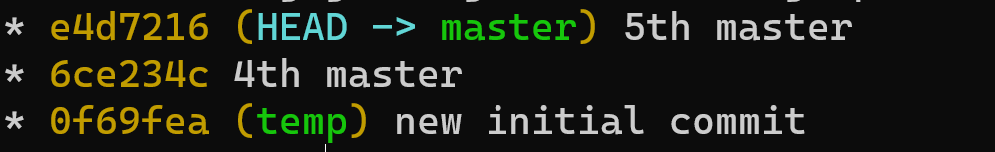


### FIX ME
```
git diff --name-only sha1 sha2
```

```
git diff --name-status sha1 sha2

```

```
git show ???
``` -->


## 6. Remote repos and  Gitlab

Login to your account on  ```https://git.soton.ac.uk```.
1. In the left panel select "projects"
3. In the top right click "New Project"
4. Choose "Create blank project"
5. In "Project name" write ```git-tmp```
6. Select your username from the dropdown menu next to "Project URL"
6. In "visibility Level" select private.
7. Uncheck "Intialize repository with README"

---

- Our goal is to sync the local git with the remote one. 
- First we need to inform git of the remote repository
```bash
$git remote add origin URL
```
- Here we gave it the name origin (instead of using URL every time). 
- In this case the URL is of the form ```https://git.soton.ac.uk/username/git-tmp``` 
- which you can copy directly from the browser address bar.

- Next we want to setup remote branches to be tracked by the local ones.
```bash
$git switch main
$git push -u origin main
$git switch dev 
$git push -u origin dev
```
The "-u" option is done once at the beginning, and it is short for "--set-upstream". "push" pushes the local changes to the upstream repository.

---

- Go to ```https://git.soton.ac.uk/username/git-tmp``` 
- create a new file "file4.txt", i.e. "+ new file" as shown below:
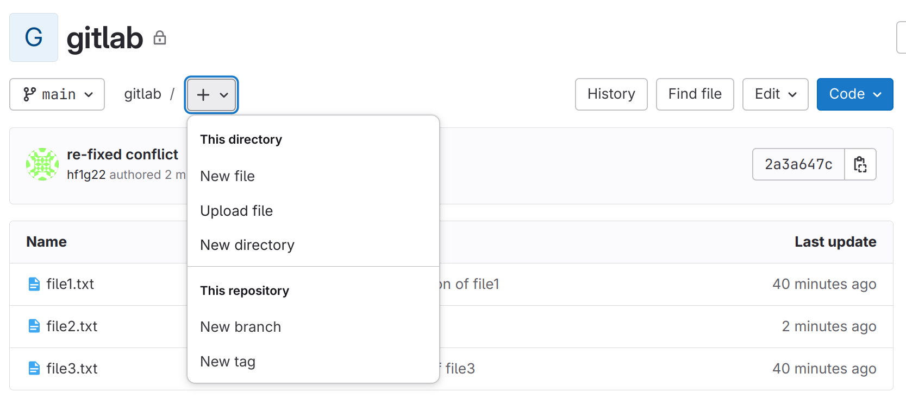. 
<!-- 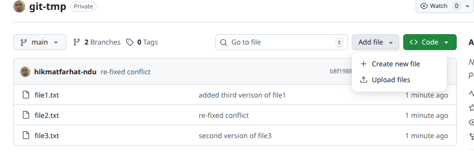 -->

Write "First version of file4" in the file and click "Commit changes".
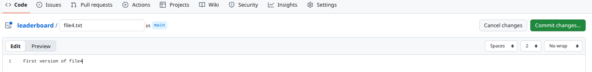

In the commit dialog write "added file4.txt" in the "Commit message" and press "Commit changes".
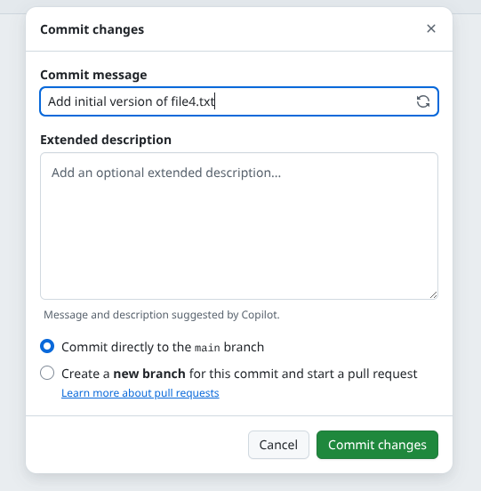

Now the remote branch main has an extra file. 

---

To synchronise the local branch
```bash
$git pull
``` 
- `pull` is a combination of `fetch` and `merge`
- if the current branch is behind the remote, ```merge```. 
- Since the current local branch is ```dev``` then ```pull``` will execute ```fetch``` only.
```bash
$git switch main
Switched to branch 'main'
Your branch is behind 'origin/main' by 1 commit, and can be fast-forwarded.
  (use "git pull" to update your local branch)
$git pull
Updating 2a3a647..cf792f5
Fast-forward
 file4.txt | 1 +
 1 file changed, 1 insertion(+)
 create mode 100644 file4.txt
```
---
<!-- 
To fetch the info about the remote 
```bash
git fetch origin
```

to associate an existing local branch with remote
```bash
git branch --set-uptream-to=origin/branch-name local-branch-name
```

If we have a local branch, say ```someBranch```, that doesn't exist in the remote, and we want to add it
with a different name, say ```anotherName```

```bash
git push --set-upstream origin anotherName

``` -->

## 7. Real (sort of) programming example

- A simple example of using `git` in software development.
- First remove all the files/folders from the current directory "git-tmp".
<!-- 
Power shell
```
>Remove-Item -Force -Recurse *
``` -->

```bash
$cd git-tmp
$shopt -s dotglob 
$rm -rf *
$shopt -u dotglob
```
- The ```shopt [-s|-u] dotglob``` sets and unsets the "*" to include "hidden" files.

- Next we initialise the repository by adding ```init_leaderboard``` and ```add_player``` functions. 
--- 

Create file ```leaderboard.py``` and copy the code below into it.

```python
from datetime import datetime,timedelta

def init_leaderboard()->dict[str,timedelta]:
    return {}


def add_player(leaderboard:dict[str,timedelta],player_name:str)->bool:
    if player_name in leaderboard:
        return False
    leaderboard.update({player_name:None})
    return True
```
---

- PyCharm and Python create a ```.idea```  and a ```__pychache``` folders respectively. 
- We don't want to add those folders to git so create a ```.gitignore``` file containing
```bash
.idea
__pycache__
```

Now commit the first version to the repo.

```bash
$git init
$git add leaderboard.py .gitignore
$git commit -m "implemented init and add_player"

```
---

Got to ```https://git.soton.ac.uk``` and create a new repository (project) called ```leaderboard``` (make sure you don't initialise it with README).

```bash
$git remote add origin https://git.soton.ac.uk/username/leaderboard
$git push -u origin main
```

Next, "two of our developers" will implement ```add_run``` and ```clear_score```. Towards that end, each developer creates a different branch
```bash
$git branch -c feature1
$git branch -c feature2
```
**Note**: Usually each developer works on their local computer. For now, we are "simulating" this workflow on the same computer. 

---

The "first developer" works on ```add_run```
```bash
$git switch feature1
```
copy the code below to ```leaderboard.py```

```python
def add_run(leaderboard:dict[str,timedelta],player_name:str,time:timedelta)->int:
    if time.total_seconds()<0:
        return 1
    if player_name not in leaderboard:
        return 2
    
    if leaderboard[player_name]==None or leaderboard[player_name]> time:
        leaderboard.update({player_name:time})
    return 0
```
---
Save the file and
```bash
$git commit -a -m "implemented add_run"
$git push -u origin feature1
```
- Now go to ```https://git.soton.ac.uk/username/leaderboard```. 
- You will see a "create merge request" button at the top of the page.
- Click the button and you will get a page that asks you, among other things, for the description of the changes.
-  Write "developer 1 implemented add_run". 
- At the bottom there is "Delete source branch..." which is already checked. 
- This is the default behaviour. 
- At the bottom press the "create merge request".


---

- Wait for "auto merge" to turn into "merge" then click merge. It takes a few seconds. When merge is done.
- delete feature 1 (ignore the warning)

```bash
$git switch main
$git branch -d feature1
```
---

The "second developer" uses the feature2 branch.
```bash
$git switch feature2
```
copy the code below to ```leaderboard.py```
```python
def clear_score(leaderboard,player_name):
    if player_name not in leaderboard:
        return False
    leaderboard.update({player_name:None})
    return True
```
Save the file and 
```bash
$git commit -a -m "implemented clear_score"
$git push -u origin feature2
```
---
Go to ```https://git.soton.ac.uk/username/leaderboard``` and follow the same procedure to do the merge request.

It will show "Merge blocked" and "Merge conflict must be resolved".

To resolve the conflict:
1. update main
2. merge main into feature2
3. resolve the conflict locally.
4. push to remote

---

```bash
$git switch main
$git pull
$git switch feature2
$git merge main

Auto-merging leaderboard.py
CONFLICT (content): Merge conflict in leaderboard.py
Automatic merge failed; fix conflicts and then commit the result.

```
---
You can fix the merge conflict by editing the code in ```leaderboard.py``` directly. When you open ```leaderboard.py``` in any editor you will see something like this:
```
............
............
<<<<<<< HEAD
def add_run(leaderboard:dict[str,timedelta],player_name:str,time:timedelta)->int:
    if time.total_seconds()<0:
        return 1
    if player_name not in leaderboard:
        return 2

    if leaderboard[player_name]==None or leaderboard[player_name]> time:
        leaderboard.update({player_name:time})
    return 0
=======
def clear_score(leaderboard,player_name):
    if player_name not in leaderboard:
        return False
    leaderboard.update({player_name:None})
    return True
>>>>>>> feature2

```
---

You can edit the above the way you like but in this case we want to keep both changes, so all we have to do is remove the lines containing "<<<<<<", ">>>>>>" and "=======" and save the file.
```bash
$git add leaderboard.py
$git commit -m "resolved conflict"
$git push origin feature2
```
Go to ```https://git.soton.ac.uk/username/leaderboard``` and you will see that the merge request that was previously blocked is ready to be merged. If the "Merge" button doesn't show reload the page. Merge then
```bash
$git switch main
$git pull
$git branch -d feature2
```
---

A second way to do the merge is by using your IDE. For example, after the second merge command, open ```leaderboard.py``` in vscode and click the button at the bottom right corner "Resolve in Merge Editor" which will open a window with 2 panes as shown below.

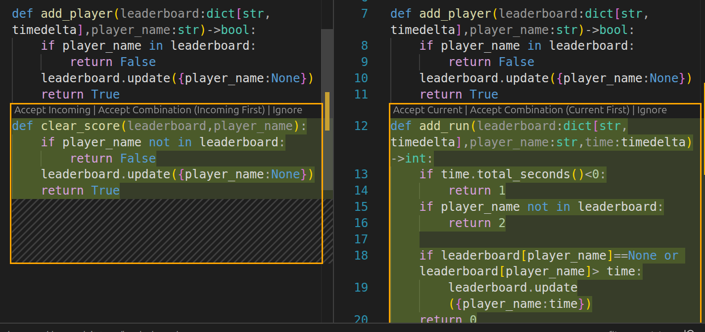
You can choose to add or remove the parts which are different. In our case we need to add both so press "Accept Combination". Press "Complete Merge" in the bottom right corner.  

---

Finally,
```bash
$git commit  -m "resolved conflict"
$git log --oneline --graph --all

*   6e1b819 (HEAD -> main, origin/main) Merge branch 'feature2' into 'main'
|\  
| *   302c68d (origin/feature2) resolved conflict
| |\  
| |/  
|/|   
* |   7e9bdab Merge branch 'feature1' into 'main'
|\ \  
| * | 628173d (origin/feature1) implemented add_run
|/ /  
| * 3d269a5 implemented clear_score
|/  
* 4682b20 implemented init and add_player

```
---

Notice how ```origin/feature1``` and ```origin/feature2``` are still there even though we asked for their deletion in the merge request. Those are stale pointers.

```bash
$git pull --prune
$git log --oneline --graph --all

*   6e1b819 (HEAD -> main, origin/main) Merge branch 'feature2' into 'main'
|\  
| *   302c68d resolved conflict
| |\  
| |/  
|/|   
* |   7e9bdab Merge branch 'feature1' into 'main'
|\ \  
| * | 628173d implemented add_run
|/ /  
| * 3d269a5 implemented clear_score
|/  
* 4682b20 implemented init and add_player

```
---

<!-- As an exercise repeat the leaderboard process but in the merge request "quash -->

<!-- 
 

Now developer 1 is tasked with implementing the function ```display_leaderboar```. First we need to bring branch ```dev``` in line with ```main```.

```bash
git switch dev
git merge main
```
Copy the code below to ```leaderboard.py```.
```python

def display_leaderboard(leaderboard,n=3):
    
    lst=sorted(leaderboard.items(),key=lambda x:x[1])
    r=min(n,len(lst))
    count=0
    
    for i in range(r):
        if lst[i][1] is not None:
            print(f'{i+1}\t{lst[i][0]}\t{lst[i][1]}')
            count+=1
    if count==0:
        print("Leaderboard is empty")
```
```bash
git commit -a -m "implemented display"
git log --oneline --graph --all
``` -->

<!-- 
```bash
* 8907ce2 (HEAD -> dev) implemented display
*   9e6f121 (origin/main, main) Merge branch 'dev' into 'main'
|\  
| *   eaed0bb (origin/dev) merged feature1 and feature2
| |\  
| | * d334c55 implemented clear_score
| |/  
|/|   
| * de952b4 implemented add_run
|/  
* 1d85f97 implemented init and add_player


``` -->

<!-- Usually it is best to run some tests before committing, which we forgot to do. Add the following code
```python
lb=init_leaderboard()
add_player(lb,player_name='Jon')
add_player(lb,player_name='Chris')
add_run(lb,player_name='Jon',time=timedelta(minutes=47))
add_run(lb,player_name='Chris',time=timedelta(minutes=18))
add_run(lb,player_name='Jon',time=timedelta(minutes=23))
display_leaderboard(lb)

``` -->
<!-- We don't want to add an extra commit but replace the last one, so
```bash
git add leaderboard.py
git commit --amend -m "implemented display with tests"

* 67f608a (HEAD -> dev) implemented display with tests
*   9e6f121 (origin/main, main) Merge branch 'dev' into 'main'
|\  
| *   eaed0bb (origin/dev) merged feature1 and feature2
| |\  
| | * d334c55 implemented clear_score
| |/  
|/|   
| * de952b4 implemented add_run
|/  
* 1d85f97 implemented init and add_player

``` -->
<!-- 
Notice how the new commit replaced the last one. The hash is different because the message is different.

We have a (almost) working code.
<!-- This development phase is done so we delete the dev branches
```bash
git branch -D dev1
git branch -D dev2
``` --> 


<!-- 
Our code has a bug. A problem occurs if a player has no run (None). For example, if we add a player "Jack" without any run we get an error when ```display_leaderboard``` is called. This is caused by the ```sorted``` function since ```None``` is not comparable.
```python
lb=init_leaderboard()
add_player(lb,player_name='Jon')
add_player(lb,player_name='Chris')
add_player(lb,player_name='Jack')
add_run(lb,player_name='Jon',time=timedelta(minutes=47))
add_run(lb,player_name='Chris',time=timedelta(minutes=18))
add_run(lb,player_name='Jon',time=timedelta(minutes=23))
display_leaderboard(lb)
```
A quick fix is to replace
```python
lst = sorted(leaderboard.items(), key=lambda x: x[1])
```
by
```python
    lst = sorted(leaderboard.items(), key=lambda x: (x[1] is None, x[1]))
```
For bug fixes we usually create a new branch. ```git switch -c fix``` then replace the code as above and
```bash
git commit -a -m "fixed sorted"
git switch main
git merge --no-ff fix
git branch -D fix
git log --oneline --graph --all
```
We have used "--no-ff" to explicitly create a new merge commit. Otherwise, git will fast-forward main to point at fix and we get a "linear" history which makes it look that the fix was applied directly to main. -->

<!-- 
We can compare the fix with the previous commit
```bash
git diff  main main~1
```

```bash
diff --git a/leaderboard.py b/leaderboard.py
index 86d4bdc..d185b2d 100644
--- a/leaderboard.py
+++ b/leaderboard.py
@@ -26,8 +26,7 @@ def clear_score(leaderboard,player_name):
 
 def display_leaderboard(leaderboard,n=3):
     
-    lst = sorted(leaderboard.items(), key=lambda x: (x[1] is None, x[1]))
-
+    lst=sorted(leaderboard.items(),key=lambda x:x[1])
     r=min(n,len(lst))
     count=0

``` -->

<!-- Finally, we push the changes to the remote
```bash
git push origin main
```  -->


